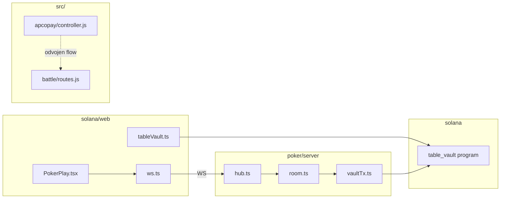

# Backend analiza potencijalnih bugova — `apconft`

## Kontekst i arhitektura

**Pregledano (read-only):**
- [`poker/server/`](poker/server/) — `room.ts`, `hub.ts`, `index.ts`, `vaultTx.ts`, `config.ts`
- [`poker/src/`](poker/src/) — engine, [`protocol.ts`](poker/src/protocol.ts)
- [`solana/web/src/poker/ws.ts`](solana/web/src/poker/ws.ts), [`PokerPlay.tsx`](solana/web/src/poker/PokerPlay.tsx) — samo WS/vault contract
- [`solana/programs/table-vault/src/lib.rs`](solana/programs/table-vault/src/lib.rs) — lock/release semantika
- [`src/`](src/) — root Express (Apcopay + battle)
- [`poker/server/room.test.ts`](poker/server/room.test.ts) + engine testovi
- [`task-evidence/`](task-evidence/) — 4 završena poker taska (auto-start, auto-next, action-timeout, waiting-sit)

**Već urađeno (ne prijavljivati kao nove bugove):**
- Auto-start pri 2. igraču, auto-next posle `finishHand`, action timeout 30s, waiting sit tokom ruke
- Namerno van scope-a prethodnih taskova: waiting `stand` tokom ruke, EC-6 vault E2E, EC-8 silent `startHand` fail, „Čeka ruku" UI label

---

## Tabela nalaza

| # | Oblast | Fajl / funkcija | Potencijalni bug / rizik | Severity | Verovatnoća | Zašto je problem | Kako reprodukovati / proveriti | Predlog minimalnog fixa | Test / QA koji treba dodati |
| - | ------ | --------------- | ------------------------ | -------- | ----------- | ---------------- | ------------------------------ | ----------------------- | --------------------------- |
| 1 | Vault replay | [`poker/server/room.ts`](poker/server/room.ts) `consumeVaultTx`, `usedVaultTxSigs` | Replay istog `lockTx` potpisa posle restarta servera | **Critical** | Visoka | `usedVaultTxSigs` je in-memory `Set` po sobi; restart briše set i seat state. Stari on-chain `lock_for_table` tx i dalje prolazi `verifyTableVaultTx` — igrač može da sedne bez novog lock-a ako je već ranije release-ovao isti buy-in | 1) Lock+sit+stand+release 2) Restart `poker:server` 3) Ponovo `sit` sa istim `lockTx` | Persist replay set (fajl/DB) ili provera da tx slot/blockTime nije stariji od sesije; opciono chain read `user_balance` pre sit | Unit test: simulirati prazan `usedVaultTxSigs` + isti sig → očekivati reject; ručni E2E posle restarta |
| 2 | Apcopay callback | [`src/apcopay/controller.js`](src/apcopay/controller.js) `handleSuccessfulPayment` | Pending order se briše i callback vraća 200 čak kad NFT mint nije izvršen | **Critical** | Visoka | `fulfillNftAfterPayment` vraća `{ skippedReason }` za missing env / invalid address, ali `deletePending(orderReference)` se uvek izvršava (linije 160–167) | Callback sa validnim pending-om ali `NFT_CONTRACT_ADDRESS` prazan → 200 OK, order obrisan, bez NFT-a | Ne brisati pending dok `skippedReason` ili tx nije uspeo; vrati 500/409 da ApcoPay retry-uje | Integration test sa mock fulfillment; ručno `simulate:callback` |
| 3 | Apcopay callback | [`src/apcopay/controller.js`](src/apcopay/controller.js) `handleSuccessfulPayment`, `paymentCallbackHandler` | Hash/pending mismatch → tihi return, spolja 200 OK | **Critical** | Srednja | Ako pending ne postoji ili hash ne matchuje (restart, tampered UDF, amount format), log + `return` bez greške; handler i dalje `res.status(200)` (linije 150–155, 140) | Restart servera između init i callback; ili promeni `amount` u callback-u | Vrati non-2xx ili zadrži pending + alert; idempotent fulfilled flag | Test: mismatch hash → očekivati retry signal, ne delete |
| 4 | Vault stand | [`poker/server/room.ts`](poker/server/room.ts) `stand()` | `consumeVaultTx` **pre** `verifyTableVaultTx` — failed verify „spaljuje" sig | **High** | Visoka | Suprotno od `sit()` (verify → re-check → consume). RPC/amount greška posle consume → `'Vault transaction already used'`, klijent mora novi release tx | Mock verify fail posle consume na stand | Premestiti consume posle uspešne verifikacije (kao `sit`) | `room.test.ts` sa mock `verifyTableVaultTx` |
| 5 | Vault / UI flow | [`solana/web/src/poker/PokerPlay.tsx`](solana/web/src/poker/PokerPlay.tsx) `handleStand`, [`poker/server/room.ts`](poker/server/room.ts) `stand()` | Release on-chain **pre** server `stand`; UI dozvoljava stand tokom ruke | **High** | Visoka | `releaseFromTable` se potpisuje pre `stand(releaseTx)` (fire-and-forget). Dugme disabled samo za `mySeat === null` (linija 624), ne za `handInProgress`. Server vraća `'Cannot leave during a hand'` (linija 164) | Tokom aktivne ruke klik „Ustani" → Phantom release uspe, server odbija → igrač i dalje seated sa stack-om, vault kreditovan | UI: disable stand tokom `handInProgress`/showdown; frontend: `stand` posle server OK ili release posle server accept | Ručni QA: stand mid-hand; assert server seat + vault balance |
| 6 | Poker concurrency | [`poker/server/hub.ts`](poker/server/hub.ts) `handleMessage`, [`poker/server/index.ts`](poker/server/index.ts) | Race: paralelni async `sit` na isto sedište | **High** | Srednja | `handleMessage` je async bez per-room mutex-a. Dva `sit` mogu proći `checkSit`, oba `await verifyTableVaultTx`, poslednji upis u `this.seats[seat]` pobedi — gubitnik ima potrošen lock | Dva WS klijenta / skripte: istovremeno `sit-check`+`sit` na seat 0 | Per-room promise chain / mutex oko mutating operacija | Integration test sa dva paralelna sit poziva |
| 7 | WS security | [`poker/server/hub.ts`](poker/server/hub.ts) `join()` | Nema autentifikacije `playerId` — client-supplied wallet adresa | **High** | Srednja | `join` prihvata bilo koji string ≥8 chars (linije 88–95). Ko zna tuđu adresu može da se join-uje i šalje `action` kad je taj igrač na potezu (ako postoji otvoren tab) | Dva taba: tab A wallet X, tab B join kao X bez Phantom-a → action kada je red na X | Wallet signature challenge pri join (poseban task) ili session token | Hub test: join bez auth + action spoof |
| 8 | WS session | [`poker/server/hub.ts`](poker/server/hub.ts) `join`, `handleClose` | Dupli tab isti `playerId`; disconnect ne uklanja seat | **High** | Visoka | Svaki WS = nova konekcija; nema „one session per player". `handleClose` samo briše connection — igrač ostaje seated, timeout fold/check nastavlja | Otvori 2 taba isti Phantom; zatvori tab tokom ruke | Evict stari WS na re-join; opciono auto-stand na disconnect (veliki UX task) | Ručni QA: 2 taba + disconnect mid-hand |
| 9 | Vault verify | [`poker/server/vaultTx.ts`](poker/server/vaultTx.ts) `verifyTableVaultTx` | Mint account (IDL index 1) se ne proverava protiv `POKER_TABLE_MINT` | **High** | Niska–srednja | Verifikacija koristi server `mint` samo za `chipsToRaw` decimals, ne poredi `accountIndexes[1]` sa očekivanim mint-om. Lock na drugom mint-u istog programa/decimals može proći | **Potrebna potvrda** — zahteva drugi mint + isti raw amount | Dodati `ixMint.equals(expectedMint)` check | `vaultTx.test.ts` wrong-mint reject |
| 10 | Vault accounting | [`solana/programs/table-vault/src/lib.rs`](solana/programs/table-vault/src/lib.rs) `release_from_table`, [`room.ts`](poker/server/room.ts) `stand` | Release amount = server `stack` može biti veći od lock-ovanog `buyIn` | **High** | Visoka | On-chain nema cap vs prior lock. Pobednik sa stack 800 release-uje 800 iako je lock bio 500 → `user_balance` inflacija u odnosu na početni lock | Win hand → stand sa `myStack > buyIn` → uporediti vault PDA pre/posle | On-chain session ledger ili server cap release na locked amount (zahteva program change — poseban task) | E2E: win → stand → vault balance math |
| 11 | Vault race | [`hub.ts`](poker/server/hub.ts) `sit-check`, [`room.ts`](poker/server/room.ts) `sit` | `sit-check` ne rezerviše sedište; lock tokom Phantom delay-a | **Medium** | Visoka | `sit-check` je čista validacija. Drugi igrač može zauzeti seat pre `sit`; gubitnik ima izvršen lock, refund zahteva drugi Phantom potpis ([`PokerPlay.tsx`](solana/web/src/poker/PokerPlay.tsx) linije 184–208) | Dva igrača: oba prođu sit-check za seat 0, oba lock-uju, sporiji `sit` → Seat taken + refund flow | Kratkotrajni seat hold TTL posle sit-check-ok (server-side) | Ručni QA: race 2 profila isti seat; automatski concurrent sit test |
| 12 | Env / security | [`poker/server/config.ts`](poker/server/config.ts), [`room.ts`](poker/server/room.ts) `sit` | `POKER_TABLE_MINT` prazan → vault check tiho isključen | **Medium** | Srednja | `vaultRequired = !skip && tableMint !== null` — bez mint-a sits rade bez lock tx. Startup samo `console.warn` ([`index.ts`](poker/server/index.ts) 34–36) | Pokrenuti server bez `POKER_TABLE_MINT`, sit bez lock-a uspe | Fail-fast pri startu ako mint prazan i skip nije uključen | Config test / startup assertion |
| 13 | State sync / UX | [`room.ts`](poker/server/room.ts) `applyAction` → `finishHand` → `tryAutoStartNextHandAfterFinish` | Fold-win: nema showdown prozora; auto-next odmah — klijent ne vidi `winners` | **Medium** | Visoka | `awardToSingleWinner` ne postavlja `showdownReveal`; `finishHand` null-uje table i pokreće sledeću ruku pre nego hub pošalje winner snapshot | 2 igrača, preflop fold → UI skoči na novu ruku bez winner prikaza | Kratki „hand complete" delay ili broadcast pre auto-next (samo fold path) | Assert snapshot ima winners pre auto-next |
| 14 | Vault bust | [`room.ts`](poker/server/room.ts) `removeBustedSeats` | Busted igrač (stack 0) uklonjen bez `release_from_table` | **Medium** | Visoka (ako vault ON) | Komentar linija 422: namerno bez release. On-chain lock ostaje subtracted — chipovi „izgubljeni" u vault accounting modelu | All-in bust → seat cleared, vault balance ne raste | Dokumentovati ekonomski model ili zahtevati release 0 / partial (program+server task) | E2E bust → proveriti vault PDA |
| 15 | Apcopay | [`controller.js`](src/apcopay/controller.js) `handleSuccessfulPayment` | Nema idempotencije — dupli PROCESSED callback može dupli mint | **Medium** | Srednja | Nema `fulfilled` flag po orderReference; retry posle uspešnog mint-a pre delete → drugi mint | Dupli POST callback isti OrderReference | `fulfilledOrders` Set/DB + early return na replay | Idempotency test |
| 16 | Apcopay validation | [`controller.js`](src/apcopay/controller.js) `paymentInitRequest` | Slaba validacija `amount`, `nftRecipient`, `currency` | **Medium** | Srednja | `amount` može biti 0/negativan/NaN (`toFixed` throw); `nftRecipient` samo truthy, ne ETH address format | `amount: "abc"` → 500; `amount: 0` → init uspe | Validacija: finite amount > 0, `ethers.isAddress` | Unit testovi init edge cases |
| 17 | WS contract | [`solana/web/src/poker/ws.ts`](solana/web/src/poker/ws.ts) `sitAndWait`, `stand` | `stand`/`start-hand`/`action` bez pending/ack; greška samo globalni `error` | **Medium** | Visoka | Samo `sit`/`sit-check` imaju `waitFor` + 12s timeout. `stand` fire-and-forget — korisnik ne zna da li je server prihvatio | Stand tokom ruke → error u `error` state, ali release već prošao | `standAndWait` sa error propagation; ili disable UI (vidi #5) | Frontend contract test |
| 18 | WS contract | [`ws.ts`](solana/web/src/poker/ws.ts) `onmessage` | `sit` success = `table` sa `you.seat === pending.seat` — nema provere `buyIn` | **Low** | Niska | Teoretski lažni success ako je već seated na istom seat-u; praktično server vraća `Already seated` error | Retry sit isti seat posle uspeha | Eksplicitni `sit-ok` server message ili provera stack/buyIn | Protocol extension task |
| 19 | Poker hub | [`hub.ts`](poker/server/hub.ts) `handleMessage` | `sit` error + uvek `broadcastTable` — race sa pending waiter | **Low** | Niska | Na error šalje `error` pa broadcast; redosled WS poruka može zbuniti klijent ako `table` stigne posle `error` sa kontradikcijom | Brzi error path + broadcast | Uvesti redosled ili ne broadcast-ovati na sit error | Hub integration test |
| 20 | Room lifecycle | [`room.ts`](poker/server/room.ts) `tryAutoStartHand`, `tryAutoStartNextHandAfterFinish` | Ignorišu return value `startHand()` — tiho neuspeće | **Low** | Niska | Ako engine odbije start (npr. edge stack), igrači seated bez ruke | **Potrebna potvrda** — teško reprodukovati sa normalnim buy-in | Log warning + opcioni broadcast error | Mock `startHand` fail |
| 21 | Memory | [`room.ts`](poker/server/room.ts) `usedVaultTxSigs` | Set raste neograničeno | **Low** | Niska (dug sesija) | Replay zaštita OK, ali nema pruning | Duga dev sesija sa mnogo sit/stand | LRU cap ili periodic prune starih sig | Info/monitoring |
| 22 | Root backend | [`src/orders/orderStore.js`](src/orders/orderStore.js) | In-memory pending orders — gubitak na restart | **Medium** | Visoka (prod) | Isti root cause kao #3 za poker nije, ali za Apcopay flow kritično | Restart između payment init i callback | Persistent store | Integration test persistence |
| 23 | Root security | [`src/apcopay/routes.js`](src/apcopay/routes.js) `seedPendingForTest` | Neautentifikovan seed endpoint kad `ALLOW_TEST_SEED=true` | **Medium** | Niska (ako env OFF) | Omogućava injekciju pending order-a | `ALLOW_TEST_SEED=true` + POST seed | Hard-disable u produkciji / auth | Config review |
| 24 | Root security | [`src/apcopay/auth.js`](src/apcopay/auth.js) `checkSignature` | Nije `timingSafeEqual` | **Low** | Niska | Teoretski timing leak HMAC-a | Security review | `crypto.timingSafeEqual` | Unit test |
| 25 | Root config | [`src/config.js`](src/config.js) | `IS_TEST` default `true`; svi ApcoPay env `req()` pri importu | **Low** | Srednja | Server ne startuje bez payment env čak i za battle-only; test mode default može biti opasan | Pogrešan deploy env | Dokumentovati; razdvojiti config po servisu | Smoke start test |
| 26 | WS types | [`ws.ts`](solana/web/src/poker/ws.ts) `TableState` vs [`poker/src/types.ts`](poker/src/types.ts) | Frontend tipovi izostavljaju `smallBlindSeat`, `bigBlindSeat`, `potIndex` | **Info** | N/A | Runtime JSON extra polja se ignorišu; TS drift | Typecheck | Sync tipova ili generiši iz protocol | N/A |
| 27 | Test gap | [`poker/server/room.test.ts`](poker/server/room.test.ts) | Svi testovi sa `POKER_SKIP_VAULT_CHECK=1` | **Info** | N/A | Vault verify, stand release, replay, mint check — **0** automatske pokrivenosti | `npm run poker:test` | Dodati `vaultTx` + vault-enabled room testove sa mock RPC | vidi sekciju ispod |
| 28 | Test gap | — | Nema `hub.test.ts`, nema root `src/` test skripte | **Info** | N/A | [`AI_TESTING_AND_ACCEPTANCE_RULES.md`](AI_TESTING_AND_ACCEPTANCE_RULES.md) potvrđuje | — | Hub WS integration; Apcopay unit | Prioritetni test plan |

---

## Test coverage — šta je pokriveno / šta nije

### Pokriveno (`npm run poker:test` — 40 testova)

| Oblast | Testovi u [`room.test.ts`](poker/server/room.test.ts) |
|--------|------------------------------------------------------|
| Auto-start (2. igrač) | `first sit does not auto-start`, `second sit auto-starts hand`, `failed sit does not auto-start` |
| Auto-next | `auto-starts next hand after fold`, `does not auto-start when one seated`, duplicate start reject |
| Waiting sit | Suite `PokerRoom waiting sit` (7 testova) |
| Action timeout | Suite `PokerRoom action timeout` (8 testova) |
| Showdown display | `enters showdown phase with revealed cards` |
| Busted cleanup | `removes busted player after hand ends` |
| checkSit | taken seat, already seated |
| Engine | [`table.test.ts`](poker/src/table.test.ts), [`pot.test.ts`](poker/src/pot.test.ts), [`hand-eval.test.ts`](poker/src/hand-eval.test.ts) |

### Nije pokriveno (zahteva nove testove ili ručni QA)

| Rizik | Predlog minimalnog testa | Ručni QA |
|-------|--------------------------|----------|
| #1 lockTx replay posle restart | Mock prazan `usedVaultTxSigs` + isti sig | Restart server → retry isti lockTx |
| #4 stand consume order | Mock verify fail → sig još upotrebljiv | Phantom release fail scenario |
| #5 stand mid-hand desync | — | Stand tokom aktivne ruke |
| #6 concurrent sit | Dva paralelna `room.sit` sa delay mock | 2 Chrome profila isti seat race |
| #9 wrong mint | `vaultTx.test.ts` | Devnet sa 2 mint-a |
| #10 release > buyIn | — | Win hand → stand → vault math |
| #11 sit-check race | Concurrent sit test | 2 profila isti seat |
| #13 fold winner UX | Snapshot pre auto-next | Preflop fold — da li se vidi pobednik |
| #14 bust bez release | — | All-in bust → vault PDA |
| Hub/WS (#7, #8, #17) | `hub.test.ts` sa mock WS | 2 taba, disconnect |
| Root Apcopay (#2, #3, #15) | `controller.test.js` | `simulate:callback` |
| Vault E2E | — | Pun flow: deposit → lock → sit → release (EC-6 iz task-evidence) |

### Male testove koje vredi dodati (bez velikog refactora)

1. `poker/server/vaultTx.test.ts` — wrong mint, wrong amount, failed on-chain tx
2. `poker/server/room.test.ts` — `stand` consume-after-verify redosled (mock verify)
3. `poker/server/hub.test.ts` — join + duplicate connection + error+broadcast order
4. `src/apcopay/controller.test.js` — hash mismatch ne briše pending; skipped NFT ne briše pending
5. `room.test.ts` — fold path: assert `winners` pre nego `handInProgress` ponovo true (regresija #13)

---

## Top prioriteti

1. **#1 Vault lockTx replay posle server restarta** — direktan security/ekonomski rizik za poker sa uključenim vault check-om
2. **#2 + #3 Apcopay callback + NFT fulfillment** — plaćanje potvrđeno, NFT/order izgubljen (root backend, odvojen od poker-a ali Critical u svom domenu)
3. **#5 Stand flow desync (release pre server accept, UI dozvoljava mid-hand)** — lako reprodukovabilno, pogoršava vault accounting
4. **#4 Stand consume-before-verify** — usaglašiti sa `sit` redosledom; mali diff, visok uticaj
5. **#6 Concurrent sit race** — multi-player scenarij sa vault latency-jem

---

## Quick wins

| Fix | Fajl | Effort |
|-----|------|--------|
| Premestiti `consumeVaultTx` posle verify u `stand()` | [`room.ts`](poker/server/room.ts) | ~5 linija |
| Disable „Ustani" kada `handInProgress \|\| showdownActive` | [`PokerPlay.tsx`](solana/web/src/poker/PokerPlay.tsx) | 1 uslov |
| Fail-fast ako `!SKIP_VAULT_CHECK && !POKER_TABLE_MINT` | [`index.ts`](poker/server/index.ts) | ~3 linija |
| Dodati mint account check u `verifyTableVaultTx` | [`vaultTx.ts`](poker/server/vaultTx.ts) | ~3 linija |
| Apcopay: ne `deletePending` kad `skippedReason` | [`controller.js`](src/apcopay/controller.js) | ~5 linija |
| Log warning kad `tryAutoStart*` / `startHand` vrati error | [`room.ts`](poker/server/room.ts) | ~2 linije |

---

## Ne dirati bez posebnog taska

| Oblast | Razlog |
|--------|--------|
| [`poker/src/table.ts`](poker/src/table.ts) engine (side pots, all-in runout) | Visok regresioni rizik; trenutno nema prijavljenog produkcijskog buga |
| [`solana/programs/`](solana/programs/) Anchor program | `release_from_table` cap, on-chain session — zahteva anchor build/test/WSL |
| Waiting `stand` tokom ruke | Namerno ostavljeno ([`poker-allow-sit-during-hand.plan.md`](task-evidence/poker-allow-sit-during-hand/poker-allow-sit-during-hand.plan.md)) |
| WS auth / wallet signature pri `join` | Arhitekturalna promena contract-a |
| Auto-next / auto-start logika | Stabilno pokrivena 40 testova |
| Action timeout 30s fold-vs-call | Prihvaćeno po specifikaciji taska |
| Root `genErrHandler`, CORS, rate limits | Širi hardening task |
| `.env.example`, `package.json` | Eksplicitna zabrana u user scope-u |

---

## Predloženi sledeći taskovi

| Task slug | Opis |
|-----------|------|
| `poker-vault-replay-persistence` | Persist `usedVaultTxSigs` + reject stale lock proofs |
| `poker-stand-vault-order-fix` | `stand()`: verify pre consume + unit test |
| `poker-stand-ui-guard` | Disable stand tokom ruke; `standAndWait` ili error handling |
| `poker-hub-concurrency-mutex` | Per-room serialization za sit/stand |
| `poker-vaulttx-mint-verify` | Mint account validation + `vaultTx.test.ts` |
| `poker-fold-winner-display` | Kratki hand-complete broadcast pre auto-next |
| `poker-hub-ws-integration-tests` | hub.test.ts: join, disconnect, duplicate tab |
| `backend-apcopay-callback-idempotency` | Pending/fulfilled flags, no silent 200 on mismatch |
| `backend-apcopay-nft-skip-fix` | Ne brisati pending na skipped mint |
| `poker-vault-e2e-manual-qa` | Ručni checklist EC-6 (dva profila, pun vault flow) |
| `poker-bust-vault-accounting` | Analiza/dokumentacija bust vs release ekonomije |

---

## Zaključak

Poker server je **dobro pokriven unit testovima** za game lifecycle (auto-start/next, timeout, waiting sit), ali **vault i hub sloj imaju najveće rizike** — posebno replay posle restarta, stand ordering, i frontend/server desync oko release. Root Express backend (Apcopay) ima **kritične fulfillment/callback probleme** nezavisne od poker flow-a. Frontend WS contract je **funkcionalno usklađen** za message tipove, ali **asimetričan error/ack model** za `stand`/`action` i **stand UI guard** stvaraju realne E2E bugove.

**Nijedna izmena nije urađena** — ovo je isključivo analitički izveštaj.
