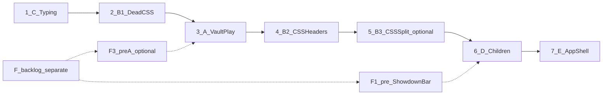

# Globalni FE refactor roadmap — preostali `solana/web`

**Tip dokumenta:** referentni roadmap (analysis / inventory only)  
**Datum:** 2026-06-26  
**Status:** sačuvano za buduću referencu — **nije implementacija**

---

## Svrha ovog dokumenta

Ovaj fajl je **trajna referenca** za globalni FE refactor preostalog `solana/web` frontend-a.

- **Nije implementacija** — nema production izmena vezanih za ovaj dokument.
- **Nije Phase 8** zatvorene inicijative **Poker tab / `PokerPlay.tsx` clean-code refactor** (Phase 1–6 + Commit 7; evidence: `task-evidence/fe-clean-code-refactor/`). To je **novi, globalni FE roadmap** sa sopstvenim inicijativama 1–7.
- **Svaka inicijativa 1–7** će se **kasnije posebno analizirati** (fresh scan oblasti) i **razbiti u sigurne faze** pre bilo kakve implementacije — po istom principu kao Phase 1–6 za Poker tab. Ovaj dokument definiše samo **redosled i okvir**, ne fazne commit-e.
- **F backlog** ostaje **odvojen** od refactor roadmap-a 1–7 — bugfix/hardening/UX taskovi, ne refactor faze.
- **Primarni FE reference** za svaku buduću inicijativu: [`FRONTEND_TECHNOLOGY_RESEARCH.md`](../../FRONTEND_TECHNOLOGY_RESEARCH.md). Praktična primena: [`FRONTEND_BEST_PRACTICES.md`](../../FRONTEND_BEST_PRACTICES.md). Project facts: [`APCONFT_PROJECT_REFERENCE.md`](../../APCONFT_PROJECT_REFERENCE.md).

**Commit / push:** nije urađen pri kreiranju ovog evidence fajla.

---

## 1. Kontekst

### Zatvoreno (ne nastavljati kao Phase 8)

**Poker tab / `PokerPlay.tsx` clean-code refactor** — evidence: `task-evidence/fe-clean-code-refactor/phases/phase-{1..6}/`.

Stabilno: `solana/web/src/poker/PokerPlay.tsx`, `usePokerSeating.ts`, WS barrel `ws.ts`, shared vault moduli (Phase 4), poker CSS header-i (Phase 6).

### Git snapshot (inventory, 2026-06-26)

| Stavka | Vrednost |
|--------|----------|
| Branch | `feature/fe-clean-code-refactor` |
| Working tree | Clean |
| HEAD | `1c6d15b` |

### Princip rada

1. **Svaki broj 1–7 = posebna mini-roadmap inicijativa** — pre implementacije: fresh scan te oblasti + **fazni plan sa sigurnim fazama** + novi `task-evidence/<initiative-name>/`.
2. **Ništa se ne implementira** iz ovog roadmap-a direktno — korisnik eksplicitno otvara sledeću inicijativu u novom tasku/chat-u.
3. **F backlog je odvojen** — nije deo refactor redosleda 1–7; ne mešati u refactor commit-e.
4. Svaka inicijativa zahteva pre starta: **cilj, scope, šta ne dirati, rizik, QA, user decisions** (detalji ispod).

### Globalno — šta ne dirati

- WS contract — `solana/web/src/poker/ws.ts` public API
- Vault on-chain redosled — `solana/web/src/vault/tableVault.ts`
- `.env`, `.env.example`, `package.json`, `package-lock.json`
- Poker server, Anchor program, dalji `ws.ts` split

---

## 2. Prihvaćeni globalni refactor redosled

Redosled je **prihvaćen kao najbezbedniji** — minimizuje rework i regresiju.

| # | Inicijativa | Oblast | Tip | Rizik | Budući evidence folder (predlog) |
|---|-------------|--------|-----|-------|-----------------------------------|
| **1** | **C** | Typing / `vite-env.d.ts` | Refactor | Nizak | `task-evidence/fe-refactor-c-typing/` |
| **2** | **B.1** | Dead CSS u `index.css` | Refactor | Nizak | `task-evidence/fe-refactor-b1-dead-css/` |
| **3** | **A** | Vault tab / `VaultPlay.tsx` | Refactor | Srednji | `task-evidence/fe-refactor-a-vault-ui/` |
| **4** | **B.2** | CSS section header-i | Refactor | Nizak | `task-evidence/fe-refactor-b2-css-headers/` |
| **5** | **B.3** | CSS file split | Refactor (opciono) | Srednji | `task-evidence/fe-refactor-b3-css-split/` |
| **6** | **D** | Poker child komponente (suženo) | Refactor | Nizak–srednji | `task-evidence/fe-refactor-d-poker-children/` |
| **7** | **E** | App shell / providers | Refactor | Nizak | `task-evidence/fe-refactor-e-app-shell/` |

**Sledeći korak (kada korisnik bude spreman):** otvoriti **Inicijativu 1 (C)** — posebna analiza + mini-roadmap sa fazama pre implementacije.

---

## 3. Precondition napomene (F backlog — nisu refactor faze)

F ostaje **odvojen bugfix/hardening backlog**. Dve stavke su vezane za refactor redosled samo kao **precondition napomene**, ne kao brojevi 1–7.

### F3 — opciona pre-A precondition (Inicijativa 3)

| | |
|---|---|
| **Šta** | `loadTableVaultIdl.ts` — nema `response.ok` provere |
| **Tip** | Hardening (F backlog), **nije refactor faza** |
| **Veza sa redosledom** | A dira vault/IDL put; ako odlučimo F3 **pre** Inicijative 3, smanjujemo rework u A |
| **Ako ne radimo F3** | A i dalje može ići; F3 ostaje u F backlog-u |

### F1 — precondition pre ShowdownBar u Inicijativi 6

| | |
|---|---|
| **Šta** | Countdown treći silent state — valid deadline, invalid `clockAnchor` → nema bar ni fallback (`showdown.ts`) |
| **Tip** | Bug-risk (F backlog), **nije refactor faza** |
| **Veza sa redosledom** | **ShowdownBar ne ulazi u Inicijativu 6** dok F1 nije rešen ili eksplicitno odobren |
| **Inicijativa 6 scope** | PlayingCard, PotBreakdown, RebuyGraceBar — **bez ShowdownBar** pre F1 |

---

## 4. Mini-roadmap po inicijativama (detalj)

Redosled sekcija **prati prihvaćeni redosled 1–7**.  
Pre implementacije svake inicijative obavezno pročitati relevantne § iz [`FRONTEND_TECHNOLOGY_RESEARCH.md`](../../FRONTEND_TECHNOLOGY_RESEARCH.md).

---

### Inicijativa 1 — C: Typing / `vite-env.d.ts`

**Reference:** `FRONTEND_TECHNOLOGY_RESEARCH.md` §4.2, §4.3.

| | |
|---|---|
| **Cilj** | Usaglasiti `ImportMetaEnv` sa stvarnim `import.meta.env` čitanjem — samo DX, bez runtime promene |
| **Scope** | Dopuna `VITE_POKER_WS_URL` (`wsConfig.ts`), `VITE_POKER_SKIP_VAULT_CHECK` (`vaultConfig.ts`); optional `?` gde env nije obavezan |
| **Ne dirati** | `.env.example`, runtime fallback stringovi, env logika |
| **Rizik** | Nizak |
| **QA** | `npm run build --prefix solana/web`; TS bez novih grešaka; smoke start frontend-a dovoljan |
| **User decisions** | Optional env tipovi (`?` vs `string`); ne uključivati `noUnusedLocals` u istom task-u |
| **Pre implementacije** | Fresh scan `vite-env.d.ts` + sva `import.meta.env` čitanja; fazni plan u `task-evidence/fe-refactor-c-typing/` |

---

### Inicijativa 2 — B.1: Dead CSS u `index.css`

**Reference:** `FRONTEND_TECHNOLOGY_RESEARCH.md` §4.7.

| | |
|---|---|
| **Cilj** | Ukloniti potvrđeno mrtav CSS — 0 vizuelne promene |
| **Scope** | Uklanjanje klasa koje postoje **samo u CSS**, nigde u TSX: `.table-visual--vault` (+ nested), `.panel--actions`, `.panel--waiting`, `.action-hint` |
| **Ne dirati** | `:root` tokeni, poker countdown/showdown/winner klase, responsive `@media (max-width: 540px)` |
| **Rizik** | Nizak |
| **QA** | Build; visual smoke Poker + Vault tab; mobile ~540px |
| **User decisions** | Screenshot baseline pre uklanjanja |
| **Pre implementacije** | Fresh grep CSS klasa vs TSX; fazni plan u `task-evidence/fe-refactor-b1-dead-css/` |

---

### Inicijativa 3 — A: Vault tab / `VaultPlay.tsx`

**Reference:** `FRONTEND_TECHNOLOGY_RESEARCH.md` §4.5, §4.6, §4.8, §4.9, §6.

**Precondition (opciono, van refactor redosleda):** F3 pre starta — vidi §3.

| | |
|---|---|
| **Cilj** | Organizovati 332L monolit u hook + pure helperi + presentation komponente — **bez promene** deposit/withdraw/ATA i Anchor account redosleda |
| **Scope** | `useVaultPlay` (ili slično), pure helperi (`humanToRaw`, format), `VaultBalancePanel` / `VaultActionsPanel`; reuse `loadTableVaultIdl`, `vaultPdas`, `vaultConfig` |
| **Ne dirati** | `tableVault.ts`, poker tab, env/program ID logika |
| **Rizik** | Srednji — wallet tx samo iz user handlera |
| **QA** | Build; Vault tab pun flow: connect, balansi, ATA, deposit, withdraw, greške bez wallet/SOL |
| **User decisions** | Mint editable vs `VITE_MINT` fiksiran; unifikacija IDL load sa `useVaultBalance`; broj presentation komponenti |
| **Pre implementacije** | Fresh scan `VaultPlay.tsx` + vault moduli; fazni plan (Phase 1–N) u `task-evidence/fe-refactor-a-vault-ui/` |

---

### Inicijativa 4 — B.2: CSS section header-i

**Reference:** `FRONTEND_TECHNOLOGY_RESEARCH.md` §4.7.

| | |
|---|---|
| **Cilj** | Dopuniti organizaciju `index.css` — comment-only section header-i, 0 vizuelne promene |
| **Scope** | Vault tab sekcija (posle A zna se tačan Vault UI); eventualno generic forms; reorder postojećih pravila pod header-e |
| **Ne dirati** | Boje/tokeni bez UX odluke; poker osetljive klase bez browser QA |
| **Rizik** | Nizak |
| **QA** | Build; visual smoke oba taba |
| **User decisions** | Koje sekcije osim Vault (npr. generic `.panel`, `.btn-row`) |
| **Pre implementacije** | Fresh scan `index.css` strukture; fazni plan u `task-evidence/fe-refactor-b2-css-headers/` |

---

### Inicijativa 5 — B.3: CSS file split (opciono)

**Reference:** `FRONTEND_TECHNOLOGY_RESEARCH.md` §4.7, §7.

| | |
|---|---|
| **Cilj** | Split globalnog CSS u feature fajlove — arhitekturalna odluka, ne obavezan korak |
| **Scope** | npr. `shell.css`, `poker.css`, `vault.css`; import u `main.tsx` |
| **Ne dirati** | Ponašanje klasa; redosled specifičnosti bez analize |
| **Rizik** | Srednji — regresija vizuala na oba taba |
| **QA** | Build; **pun** visual diff Poker + Vault + mobile pre acceptance-a |
| **User decisions** | **Da li uopšte raditi B.3** — može se preskočiti |
| **Pre implementacije** | User decision za B.3; fazni plan u `task-evidence/fe-refactor-b3-css-split/` |

---

### Inicijativa 6 — D: Poker child komponente (suženo)

**Reference:** `FRONTEND_TECHNOLOGY_RESEARCH.md` §4.1, §4.8, §4.10, §6.

**Precondition:** **ShowdownBar isključen** dok F1 nije rešen — vidi §3.

| | |
|---|---|
| **Cilj** | Pure helper / presentation granice za izolovane child module — bez promene poker flow-a |
| **Scope (u refactor-u)** | `PlayingCard.tsx` → npr. `cards.ts`; `PotBreakdown.tsx`, `RebuyGraceBar.tsx` — samo ako ima smisla (već mali) |
| **Van scope-a** | `ShowdownBar.tsx` pre F1; `PokerPlay`, `usePokerSeating`, `ws.ts`, `PokerControlsPanel` |
| **Ne dirati** | `countdownReady` / `showDeadlineFallback` wiring; `ShowdownBar key={resultEndsAt}` |
| **Rizik** | Nizak za PlayingCard; ShowdownBar **ne dirati** u ovoj inicijativi |
| **QA** | Build; karte/board; side pots; rebuy grace timer |
| **User decisions** | Da li uopšte raditi D (nizak benefit); koje od tri komponente su u scope-u |
| **Pre implementacije** | Fresh scan child komponenti; fazni plan u `task-evidence/fe-refactor-d-poker-children/` |

---

### Inicijativa 7 — E: App shell / providers

**Reference:** `FRONTEND_TECHNOLOGY_RESEARCH.md` §4.1, §4.5.

| | |
|---|---|
| **Cilj** | Opciono izdvojiti provider/tab shell iz `App.tsx` — bez promene wallet/RPC/tab ponašanja |
| **Scope** | npr. `providers/WalletProviders.tsx`; opciono `useAppTab` |
| **Ne dirati** | Phantom-only, `autoConnect`, `DEFAULT_RPC`, StrictMode/polyfill redosled u `main.tsx` |
| **Rizik** | Nizak; mali benefit (81L) |
| **QA** | Build; connect/disconnect; tab switch Poker ↔ Vault |
| **User decisions** | Da li E uopšte raditi; samo provider extract vs i tab hook |
| **Pre implementacije** | Fresh scan `App.tsx` / `main.tsx`; fazni plan u `task-evidence/fe-refactor-e-app-shell/` |

---

## 5. F backlog — odvojeno od refactor roadmap-a (1–7)

**Nije refactor.** Svaki F item = poseban bugfix/hardening/UX task, sopstveni evidence, **ne mešati** u inicijative 1–7.

| ID | Problem | Tip | Veza sa refactor redosledom |
|----|---------|-----|----------------------------|
| **F1** | Countdown treći silent state | Bug-risk | Precondition pre ShowdownBar u Inicijativi 6 (§3) |
| **F2** | `playerId === null` bez `clearPending` | Bug-risk | Nezavisno; poseban task |
| **F3** | `loadTableVaultIdl` bez `response.ok` | Hardening | Opciona pre-A napomena pre Inicijative 3 (§3) |
| **F4** | Stand tokom result / active hand | Bug | Nezavisno; može zahtevati server |
| **F5** | Sit recovery UI | UX | Nezavisno |
| **F6** | Auto-reconnect, debounce, Nova ruka | Feature/UX | Product odluka |

**Reference:** `FRONTEND_TECHNOLOGY_RESEARCH.md` §4.4, §4.10, §6.

---

## 6. Obavezan workflow pre implementacije (svaka inicijativa 1–7)

Ovaj roadmap **ne sadrži fazne commit-e**. Pre bilo kakve implementacije inicijative N:

1. `git status --short` + **fresh scan** relevantnih fajlova te oblasti
2. Pročitati relevantne § iz [`FRONTEND_TECHNOLOGY_RESEARCH.md`](../../FRONTEND_TECHNOLOGY_RESEARCH.md)
3. Napraviti **poseban fazni plan** sa sigurnim fazama (kao Phase 1–6 za Poker tab) u `task-evidence/<initiative-name>/`
4. Proveriti precondition napomene (F3 pre 3, F1 pre ShowdownBar u 6)
5. Tek onda implementacija, build log, manual QA po oblasti

**Ništa iz ovog roadmap-a se ne implementira automatski.**

---

## 7. Verdict

| Stavka | Status |
|--------|--------|
| Tip | Referentni roadmap — **nije implementacija** |
| Odnos prema Poker tab refactor-u | **Novi globalni FE roadmap — nije Phase 8** |
| Production kod | **Nije menjan** |
| Postojeći evidence folderi | **Nisu menjan** |
| Commit / push | **Nije urađen** |
