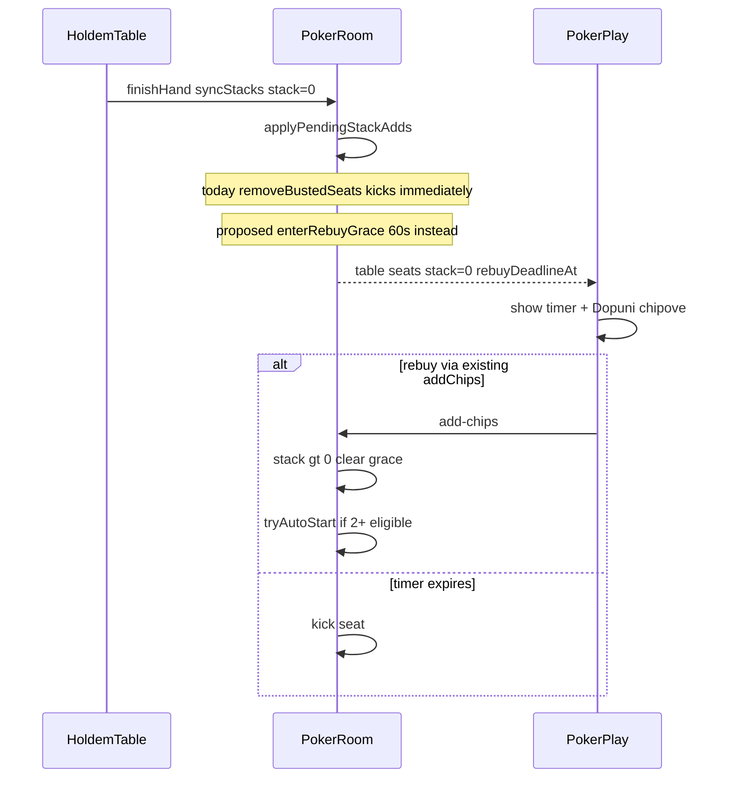

# Plan: 60s rebuy grace posle bust-a

## Current behavior found

- **Bust → instant kick:** [`poker/server/room.ts`](poker/server/room.ts) `removeBustedSeats()` (L507–514) briše svaki seat gde je `stack <= 0`. Poziva se u:
  - `finishHand()` posle `syncStacksFromTable()` + `applyPendingStackAdds()` (L457–459)
  - `startHand()` posle `applyPendingStackAdds()` (L270–271)
- **Postojeći test potvrđuje kick:** `removes busted player after hand ends` u [`poker/server/room.test.ts`](poker/server/room.test.ts) očekuje da seat postane `null` odmah posle ruke.
- **`pendingStackAdd` već štiti od kick-a ako dopuna spašava stack:** redosled u `finishHand()` je `applyPendingStackAdds()` **pre** `removeBustedSeats()`. Test `busted player with pending add stays seated after hand` to pokriva — ako pending podigne `stack > 0`, igrač **ne ulazi** u rebuy grace.
- **Nema posebnog bust statusa:** igrač je ili `seated` (`seats[i] !== null`), ili izbačen (`null`). Tokom ruke engine vidi `stack === 0` (folded/all-in); između ruku room `seats[].stack` je autoritativan posle sync-a.
- **Auto-next broji sve seated, ne playable:** `tryAutoStartNextHandAfterFinish()` (L464–467) koristi `seats.filter(Boolean).length < 2`, a `startHand()` uključuje **sve** seated u engine, uključujući potencijalni `stack === 0` — danas to nije problem jer `removeBustedSeats()` uklanja nule pre starta.
- **Add-chips već radi za seated igrača sa stack 0:** `checkAddChips()` proverava samo seated + valid amount; `addChips()` između ruku radi `stack += amount` odmah. Frontend već prikazuje „Dopuni chipove” kada je `mySeat !== null` ([`PokerPlay.tsx`](solana/web/src/poker/PokerPlay.tsx) L722–747).
- **Git task-evidence:** Nema prethodnog plana za rebuy/kick u `task-evidence/` (pregledano preko `git log --all` na `task-evidence/`). Trenutna grana `feature/poker-add-chips-before-kick` i [`task-evidence/poker-add-chips/poker-add-chips.plan.md`](task-evidence/poker-add-chips/poker-add-chips.plan.md) pokrivaju samo add-chips/pending, ne grace period.



---

## Critical edge case: rebuy add-chips dok drugi igraju ruku

**Scenario:** 3+ igrača; A bustuje → rebuy grace (`stack=0`, timer); B/C krenu novu ruku; A **nije** u `HoldemTable` (`state.players`); A klikne „Dopuni” dok je ruka aktivna.

### Šta aktivni `addChips()` radi danas (L221–228)

```typescript
const appliesFromNextHand = this.isHandActive()
if (appliesFromNextHand) {
  s.pendingStackAdd += amount
} else {
  s.stack += amount
}
```

- Grana zavisi od **globalnog** `isHandActive()`, ne od toga da li **ovaj** igrač učestvuje u ruci.
- Dok B/C igraju: `isHandActive() === true` → dopuna ide u **`pendingStackAdd`**, **`stack` ostaje 0**.
- UI dobija `appliesFromNextHand: true` („Važi od sledeće ruke”) — pogrešno za igrača koji **nije u ruci**.
- **`rebuyDeadlineAt` timer i dalje teče**; planirani kick gleda `stack <= 0` → **može izbaciti A iako je dopuna prihvaćena** (čipovi zarobljeni u `pendingStackAdd` do `finishHand` B/C, što može biti posle isteka timera).

### Da li možemo razlikovati učesnika vs rebuy-waiting?

**Da**, bez engine promene — ista distinkcija kao waiting-sit:

| Stanje | U `seats` | U `state.players` (engine) | `stack` | Grace |
|--------|-----------|----------------------------|---------|-------|
| Aktivan u ruci | da | da | engine/live | ne |
| Rebuy grace, van ruke | da | **ne** | 0 (room) | `rebuyDeadlineAt` set |
| Waiting (postojeći) | da | ne | >0 (room) | ne |

Helper (novo u `room.ts`):

```typescript
private isPlayerInCurrentHand(playerId: string): boolean {
  if (!this.table) return false
  return this.table.getState().players.some((p) => p.id === playerId)
}
```

`snapshot()` već koristi istu logiku: ako nema `live` entry za seat, prikazuje `seats[].stack` (L91–97).

### Minimalna korekcija plana (obavezna)

**Uski rebuy-specific branch** u `addChips()` — **ne** menjati opštu granu za waiting igrače (test `waiting player addChips during hand` i dalje očekuje pending):

```typescript
// Pre postojeće isHandActive grane:
if (s.rebuyDeadlineAt !== null && !this.isPlayerInCurrentHand(playerId)) {
  s.stack += amount
  this.clearRebuyGrace(seatNow)
  // optional: tryAutoStartNextHandAfterFinish() if eligible >= 2
  return { appliesFromNextHand: false }
}
// postojeća logika za in-hand / between-hands...
```

**Defense-in-depth na kick:**

- `onRebuyGraceExpired` / `removeExpiredRebuySeats`: **ne kick-ovati** ako `pendingStackAdd > 0` ili `rebuyDeadlineAt === null` (već cleared)
- Posle **bilo kog** uspešnog `addChips`: ako je `stack > 0` **ili** `pendingStackAdd > 0`, `clearRebuyGrace` + cancel timer

Ovo ne dira HoldemTable — igrač van engine-a ne utiče na betting B/C.

---

## Proposed minimal implementation plan

### Server core ([`poker/server/room.ts`](poker/server/room.ts))

1. **Proširiti `Seat`** (interno):
   

```typescript
   interface Seat {
     playerId: string
     stack: number
     pendingStackAdd: number
     rebuyDeadlineAt: number | null  // Unix ms; null = not in grace
   }
   

```
   Inicijalizovati `rebuyDeadlineAt: null` u `sit()`.

2. **Konstanta + test hook** (isti pattern kao `ACTION_TIMEOUT_MS`):
   - `export const REBUY_GRACE_MS = 60_000`
   - constructor opcija `rebuyGraceMs?: number` (default `REBUY_GRACE_MS`; testovi koriste mali npr. `50`)

3. **Zameniti logiku `removeBustedSeats()`** sa dva koraka:
   - `enterRebuyGraceForZeroStacks()` — posle `applyPendingStackAdds()`, za svaki seat gde je `stack <= 0` i **nema** aktivnog grace-a: postavi `rebuyDeadlineAt = Date.now() + rebuyGraceMs`, zakaži per-seat timer (token/seq pattern kao action/showdown timer)
   - `removeExpiredRebuySeats()` — ukloni seat samo ako `stack <= 0` **i** (`rebuyDeadlineAt === null` **ili** `Date.now() >= rebuyDeadlineAt`) — u praksi grace uvek ima deadline; kick na timer callback + defanzivno pre `startHand`

4. **`finishHand()` redosled** (minimalna izmena):
   1. `syncStacksFromTable()`
   2. `applyPendingStackAdds()`
   3. `enterRebuyGraceForZeroStacks()` — **umesto** trenutnog instant kick-a
   4. `removeExpiredRebuySeats()` — no-op za sveže grace; čisti expired ako je race
   5. `table = null`
   6. `tryAutoStartNextHandAfterFinish()` — sa **eligible** count, ne raw seated

5. **`startHand()`** — player mapping (provereno u kodu):
   - `applyPendingStackAdds()`
   - `removeExpiredRebuySeats()`
   - **Obavezno:** zadržati **fizički seat index** u mapiranju (isti pattern kao waiting-sit):
     

```typescript
     const seated = this.seats
       .map((s, seat) =>
         s && s.stack > 0 ? { id: s.playerId, seat, stack: s.stack } : null,
       )
       .filter((x): x is { id: string; seat: number; stack: number } => x !== null)
     

```
   - **Ne renumber-ovati** seatove na 0..n-1 — `HoldemTable` koristi `p.seat` za `buttonSeat`, blinds, `actionSeat`, `snapshot` mapping (`nextOccupiedSeat` po `seatedWithChips()`)
   - Novi `HoldemTable` se kreira svaki `startHand()` — rebuy/waiting igrač jednostavno **nije u `players` listi** (identično waiting-sit testu: `c` u `seats`, nije u `state.players`)
   - Ako `seated.length < 2` → `'Need at least 2 seated players'`
   - Helper: `countEligibleForHand()` = broj `seats` sa `stack > 0`

6. **`tryAutoStartNextHandAfterFinish()`** i **`tryAutoStartHand()`** (sit):
   - `tryAutoStartNextHandAfterFinish`: `countEligibleForHand() >= 2` (ne `seats.filter(Boolean).length`)
   - `tryAutoStartHand` pri sit: ostaje **seated count** — novi sit uvek ima `buyIn > 0`; nije rebuy slučaj

7. **`addChips()` — grace tokom tuđe ruke (kritično)**:
   - Dodati `isPlayerInCurrentHand(playerId)` helper
   - **Ako** `s.rebuyDeadlineAt !== null` **i** `!isPlayerInCurrentHand(playerId)`:
     - `s.stack += amount` odmah (ne `pendingStackAdd`)
     - `clearRebuyGrace(seat)` + cancel timer
     - `return { appliesFromNextHand: false }`
   - **Inače** postojeća grana: `isHandActive()` → pending, else immediate stack
   - Posle bilo kog success: ako `stack > 0` ili `pendingStackAdd > 0` → `clearRebuyGrace`
   - Ako `!isHandActive()` i `countEligibleForHand() >= 2`: `tryAutoStartNextHandAfterFinish()`
   - **Ne širiti** na sve waiting igrače van ruke — waiting player pending test ostaje nepromenjen

8. **`stand()`** — **korekcija (novi rizik u kodu):**
   - Danas: `if (this.isHandActive()) return 'Cannot leave during a hand'` — **globalno**, blokira busted igrača u grace dok B/C igraju
   - **Minimalna izmena:** blokirati stand samo ako je igrač **u trenutnoj ruci**:
     

```typescript
     if (this.isHandActive() && this.isPlayerInCurrentHand(playerId)) {
       return 'Cannot leave during a hand'
     }
     

```
   - Rebuy grace igrač van engine-a može `stand` tokom tuđe ruke
   - Pre brisanja sedišta: `clearRebuyGrace(seat)` (idempotent)

9. **Rebuy timer implementacija** (po uzoru na action/showdown):
   - **Per-seat** `setTimeout` u `Map<seat, RebuyTimerToken>` (može više grace istovremeno)
   - Token: `{ seat, playerId, seq }`; globalni ili per-seat `rebuyTimerSeq` — callback ignoriše stale seq
   - `clearRebuyGrace(seat)` **idempotentan**: `clearTimeout`, `rebuyDeadlineAt = null`, bump seq, ukloni iz mape
   - Nema `dispose`/`reset` na `PokerRoom` (hub drži room zauvek) — isto kao action/showdown; socket `handleClose` ne briše room
   - `timer.unref()` kao action timer (ne blokira process exit u testovima)

10. **Timer callback** (`onRebuyGraceExpired`):
   - Proveri seat još uvek `stack <= 0`, deadline istekao, **`pendingStackAdd === 0`**, grace još aktivan
   - Tek onda `seats[seat] = null`
   - `onTableUpdate?.()`
   - `tryAutoStartNextHandAfterFinish()` ako eligible >= 2

11. **`snapshot()` / `youState()`**:
    - `SeatInfo` u snapshot: dodati **opciono** `rebuyDeadlineAt` samo kada `stack <= 0` i grace aktivan (inače izostaviti ili `null`)
    - `YouState`: `rebuyDeadlineAt: number | null` za connected player-a (za UI timer)

### Protocol ([`poker/src/protocol.ts`](poker/src/protocol.ts))

- Proširiti `SeatInfo`: `rebuyDeadlineAt?: number | null`
- Proširiti `YouState`: `rebuyDeadlineAt: number | null`

### Hub ([`poker/server/hub.ts`](poker/server/hub.ts))

- Minimalno: `sendTableTo` već šalje `seats` i `you` — samo proslediti nova polja iz `snapshot()` / `youState()`. **Nema novih WS message tipova.**

### Frontend WS ([`solana/web/src/poker/ws.ts`](solana/web/src/poker/ws.ts))

- Proširiti `SeatInfo`, `YouState`, `PokerTableView` / parse tip sa `rebuyDeadlineAt`
- Mapirati iz `table` poruke

### Frontend UI ([`solana/web/src/poker/PokerPlay.tsx`](solana/web/src/poker/PokerPlay.tsx))

- **Timer:** kada `table.you.rebuyDeadlineAt` postoji i `myStack <= 0`, prikazati countdown (server deadline − `Date.now()`, refresh ~1s) — slično showdown fazi; može mali `RebuyGraceBar` po uzoru na [`ShowdownBar.tsx`](solana/web/src/poker/ShowdownBar.tsx) ali sa dinamičkim preostalim vremenom
- **Poruka:** npr. „Nemaš čipova — dopuni za Xs ili napuštaš sto”
- **Dopuni dugme:** već postoji; opciono vizuelno istaknuti tokom grace (`myStack <= 0 && rebuyDeadlineAt`)
- **`canStart`:** `eligibleCount >= 2` gde `eligibleCount = seats.filter(s => s && s.stack > 0).length` — server je authority za `startHand`, frontend samo ne nudi pogrešno dugme
- **`seatedCount` prikaz** („Za stolom: X/6”): može ostati `seats.filter(Boolean).length` (uključuje rebuy grace igrača sa stack 0)
- **Rebuy timer UI:** `rebuyDeadlineAt` (Unix ms) u `YouState` — primarno za self; opciono na `SeatInfo` za prikaz na tuđim mestima (3+ scenario). **Ne** slati `rebuyTimeLeftMs` — drift pri svakom broadcast-u; client računa `Math.max(0, rebuyDeadlineAt - Date.now())` (isti princip kao `showdownEndsAt`, uz lokalni fallback samo ako treba)
- Šalji `rebuyDeadlineAt` **samo** dok je grace aktivan (`stack <= 0` && deadline set); posle clear/kick — `null`/izostaviti
- **Frontend ne kick-uje** — samo prikazuje server stanje

---

## Files in scope

| Fajl | Izmena |
|------|--------|
| [`poker/server/room.ts`](poker/server/room.ts) | Seat.rebuyDeadlineAt, grace timers, eligible filtering, addChips/stand cleanup |
| [`poker/server/room.test.ts`](poker/server/room.test.ts) | Nova suite + update `removes busted player after hand ends` |
| [`poker/src/protocol.ts`](poker/src/protocol.ts) | SeatInfo + YouState polja |
| [`poker/server/hub.ts`](poker/server/hub.ts) | Pass-through (ako treba eksplicitno mapiranje) |
| [`solana/web/src/poker/ws.ts`](solana/web/src/poker/ws.ts) | Parse/map rebuyDeadlineAt |
| [`solana/web/src/poker/PokerPlay.tsx`](solana/web/src/poker/PokerPlay.tsx) | Rebuy timer UI, eligible count, UX copy |

Opciono mali novi fajl `RebuyGraceBar.tsx` — samo ako drži diff čistijim (inace inline u PokerPlay).

---

## Files not touched

- [`poker/src/`](poker/src/) HoldemTable engine
- Anchor, [`solana/web/src/vault/tableVault.ts`](solana/web/src/vault/tableVault.ts)
- Vault deposit/withdraw, [`App.tsx`](solana/web/src/App.tsx) wallet provider
- `.env`, `.env.example`, `package.json`, `package-lock.json`, dependencies
- Root backend, contracts
- **Novi add-chips WS flow** — reuse postojeći

---

## Protocol / snapshot changes

- **Additive only** — nema novih client/server message tipova
- Javno polje: `rebuyDeadlineAt` (Unix ms) na `SeatInfo` kada igrač ima `stack <= 0` u grace periodu
- `YouState.rebuyDeadlineAt` za self — autoritativan deadline za UI
- **Ne curiti:** `pendingStackAdd`, timer handle objekte, `rebuyGraceMs` config interno

---

## Timer behavior

| Događaj | Server |
|---------|--------|
| Bust posle ruke (`stack <= 0` posle pending) | Postavi `rebuyDeadlineAt`, schedule timeout |
| Pending spašava stack | Bez grace-a |
| add-chips uspeh, `stack > 0` između ruku | Clear grace, cancel timer, možda auto-start |
| Timer istekne, još `stack <= 0` | Kick seat, broadcast, možda auto-start |
| stand tokom grace | Clear timer, remove seat |
| `startHand` / auto-next | Samo `stack > 0` igrači; grace igrač ostaje seated ali **van** ruke |

**Scenariji:**

- **2 igrača, jedan bustuje:** drugi ostaje; auto-next **ne kreće** (eligible = 1) dok busted ne dopuni ili ne istekne grace
- **3+ igrača, jedan bustuje:** auto-next kreće sa ostalim eligible igračima; busted čeka na svom mestu (stack 0 + timer)
- **Dopuna pre isteka:** postojeći add-chips → stack > 0 → ulazi u sledeću ruku kao waiting/normal seated (isti pattern kao waiting sit posle rebuy između ruku)
- **Bez dopune:** kick posle 60s
- **Dopuna blizu isteka:** server odlučuje po trenutku `addChips()` apply — ako pre isteka, ostaje
- **Auto-next dok busted čeka:** hand startuje **bez** njega jer `stack === 0`; ne ulazi u engine

---

## Add-chips integration

- **Bez novog vault/WS flow-a** — koristiti postojeće `checkAddChips` → `lockForTable` → `addChipsAndWait`
- **Između ruku (grace, nema aktivne ruke):** immediate `stack`, `appliesFromNextHand: false`
- **Rebuy grace dok drugi igraju ruku (A van engine-a):** immediate `stack`, clear grace, `appliesFromNextHand: false` — **obavezna korekcija** (vidi Critical edge case)
- **Učesnik u aktivnoj ruci** (bustovan u toku ruke, još u engine-u): pending path i dalje važi
- **Waiting igrač sa stack>0 van ruke:** postojeći pending path **ostaje** (nije rebuy grace)
- Posle uspešnog rebuy add-chips: `clearRebuyGrace` + `tryAutoStartNextHandAfterFinish` ako ima 2+ eligible

---

## Test plan

U [`poker/server/room.test.ts`](poker/server/room.test.ts), injectable `rebuyGraceMs: 50`, helper `waitForRebuyTimer`:

1. Busted igrač sa 0 **nije** odmah izbačen posle ruke — seat ostaje, `rebuyDeadlineAt` set
2. Grace deadline ≈ `now + rebuyGraceMs`
3. Dopuna pre isteka → ostaje seated, `stack > 0`, `rebuyDeadlineAt` cleared
4. Bez dopune posle isteka → seat `null`
5. `pendingStackAdd` primenjen pre grace logike → nema grace ako `stack > 0`
6. Igrač sa 0 + aktivnim grace **ne ulazi** u `startHand` players list
7. **2 igrača:** A bustuje → auto-next ne startuje novu ruku
8. **3 igrača:** A bustuje → B i C igraju sledeću ruku; A ostaje na seat sa timerom
9. Snapshot `seats` — samo dozvoljena polja (`playerId`, `stack`, opciono `rebuyDeadlineAt`); bez internih polja
10. Cleanup: stand tokom grace, timer expiry, add-chips success — svi clear-uju timer (nema double-kick)
11. **3+ igrača:** A u rebuy grace, B/C aktivna ruka → A `addChips` → immediate `stack`, grace cleared, `appliesFromNextHand: false`, timer ne kick-uje A
12. **Timer guard:** A sa `pendingStackAdd > 0` (hipotetski bez grace branch) → kick ne sme da se desi

**Regresija / preimenovanje testova:**
- `removes busted player after hand ends` → **podeliti** na:
  - `busted player enters rebuy grace after hand ends` (seat ostaje, `rebuyDeadlineAt` set, stack 0)
  - `busted player is removed after rebuy timer expires` (posle `rebuyGraceMs` + flush, seat `null`)
- `does not auto-start next hand when one seated remains` → **ažurirati**: sa rebuy grace očekuje **2 seated, 1 eligible**, `handInProgress false` (ne `seats.length === 1`)
- Dodati: `does not auto-start when only one eligible player` (2 seated, 1 u grace)
- `busted player with pending add stays seated` — **zadržati** kao regression (pending pre grace)
- Ostali auto-start / waiting-sit / add-chips testovi — ne menjati ponašanje waiting pending grane

Komande posle implementacije:
```bash
npm run poker:test
npm run build --prefix solana/web
```

---

## Manual QA

- [ ] Bust → ostaješ za stolom, stack 0, vidi se 60s timer
- [ ] „Dopuni chipove” vidljivo i funkcionalno tokom grace
- [ ] Dopuna pre isteka → nastavljaš igru, timer nestaje
- [ ] Bez dopune → kick posle ~60s, seat prazan
- [ ] 2 igrača: jedan bust → druga ruka **ne** krene dok se ne rebuy/kick
- [ ] 3+ igrača: ostali nastavljaju, busted čeka sa timerom
- [ ] **3+ igrača: dopuna tokom tuđe ruke** → stack odmah veći, timer nestaje, poruka „uspešna” (ne „sledeća ruka”)
- [ ] Pending dopuna tokom ruke spašava od grace-a (postojeći flow — in-hand učesnik)
- [ ] Stand tokom grace radi (release 0)
- [ ] Restart poker servera — grace state je RAM-only (dokumentovano ograničenje, kao pending)
- [ ] Phantom add-chips lock/refund nepromenjen

---

## Risks / open questions

| Rizik / pitanje | Predlog |
|-----------------|--------|
| Server restart gubi grace | Isto kao pending — dokumentovati; van scope |
| `canStart` / seatedCount misleading | Koristiti eligible count u frontendu |
| Postojeći test `removes busted player` | **Mora** se ažurirati — očekivano ponašanje se menja |
| Minimum rebuy iznos | Zadržati postojeće: bilo koji positive integer ≤ vault balance |
| Da li kick zahteva vault release | Ne — `stack === 0`, isto kao današnji `removeBustedSeats` komentar |
| Multi-tab | Nije zatvoren ovim taskom; server re-check u addChips ostaje |
| UI countdown drift | Koristiti server `rebuyDeadlineAt`, ne lokalni 60s hardcode |
| **Rebuy add-chips tokom tuđe ruke → pending + timer kick** | **Stvaran rizik** u aktivnom kodu; obavezan uski `addChips` branch + kick guard (gore) |
| Širenje `inCurrentHand` na sve waiting igrače | **Ne** u ovom tasku — menja postojeći waiting-player pending test |

**Preporuka:** implementacija je spremna za Agent mode **posle** uključene `addChips` korekcije za rebuy-grace-van-ruke; bez nje timer može pogrešno kick-ovati igrača sa validnom dopunom.
