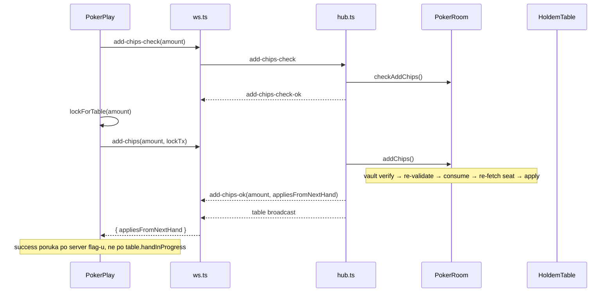

# Plan: Dopuna chipova tokom igre (finalni)

## Executive summary

Trenutno **nema** mogućnosti dopune — frontend eksplicitno blokira buy-in kada igrač sedi (`maxBuyIn = 0`), a server `checkSit()` vraća `"Already seated"`. Stack za aktivnu ruku živi u **kopiji** u `HoldemTable` (snapshot pri `startHand`), dok `PokerRoom.seats[].stack` služi između ruku.

Najbezbedniji minimalan diff:

- **Novi WS message** (`add-chips-check` / `add-chips` / `add-chips-check-ok` / `add-chips-ok`)
- Polje `pendingStackAdd` u room sloju, primena pending-a u `finishHand()` posle `syncStacksFromTable()`
- Odmah u `seats[].stack` kada ruka **nije** aktivna (uključujući između ruku)
- **Server-authoritative** `appliesFromNextHand` u `add-chips-ok` — frontend ne pogađa success poruku preko `table?.handInProgress`
- **`add-chips-ok` ack** — `addChipsAndWait()` se resolve-uje samo na validan ack, ne na `table` broadcast

---

## 1. Osnovni add-chips flow

### 1.1 Ponašanje po fazi

| Uslov | Akcija | `appliesFromNextHand` |
|-------|--------|------------------------|
| Između ruku (`!isHandActive()`) | `seats[seat].stack += amount` odmah | `false` |
| Aktivna ruka (`isHandActive()`, uklj. showdown) | `seats[seat].pendingStackAdd += amount` | `true` |
| `finishHand()` posle `syncStacksFromTable()` | `applyPendingStackAdds()` → pending u `stack`, reset pending | — |
| `startHand()` (defanzivno) | `applyPendingStackAdds()` pre `removeBustedSeats()` | — |

### 1.2 Obavezna pravila

- **Seated igrač** može da dopuni chipove (novi WS flow, ne proširenje `sit`)
- Dopuna **između ruku** odmah povećava `seats[].stack` i vidljiva je u snapshot-u
- Dopuna **tokom aktivne ruke** ne sme da menja trenutni engine stack (`HoldemTable`)
- Dopuna tokom ruke ide u `pendingStackAdd` i primenjuje se **pre sledeće ruke**
- **Showdown** se tretira kao aktivna ruka (`isHandActive()` → `inShowdown === true`) — dopuna tokom showdown-a ide u pending
- **Više dopuna** tokom iste ruke se sabira (`pendingStackAdd += amount`)
- **Bust + pending:** igrač koji padne na 0, ali ima pending dopunu, ne sme biti izbačen pre `applyPendingStackAdds()`

### 1.3 Zašto pending tokom ruke

`syncStacksFromTable()` prepisuje `seats[].stack` iz engine-a na kraju ruke. Direktan dodatak u `stack` tokom ruke bi bio izgubljen bez `pendingStackAdd`. Engine ne vidi pending — betting ostaje izolovan.



---

## 2. Server-side guard-i

### 2.1 `Seat` i snapshot

```typescript
interface Seat {
  playerId: string
  stack: number
  pendingStackAdd: number  // default 0 pri sit
}
```

- `pendingStackAdd` je **interno** polje — ne sme da curi u `protocol.ts`, `snapshot()`, niti frontend
- `snapshot().seats` vraća samo `SeatInfo`: `{ playerId, stack }` — bez spread-a celog `Seat` objekta

### 2.2 `syncStacksFromTable()` i `applyPendingStackAdds()`

- `syncStacksFromTable()` mora da **očuva** `pendingStackAdd` pri prepisu `stack` iz engine-a
- `applyPendingStackAdds()` mora biti **idempotentan**: posle primene uvek `pendingStackAdd = 0`; drugi poziv je no-op

### 2.3 `finishHand()` redosled

1. `syncStacksFromTable()`
2. `applyPendingStackAdds()`
3. `removeBustedSeats()`
4. clear table / auto-next flow

### 2.4 `startHand()` defanzivni hook

- `applyPendingStackAdds()` pre `removeBustedSeats()` — zaštita ako pending nije primenjen u `finishHand`

### 2.5 `addChips()` obavezni redosled

1. Validacija (`checkAddChips`: seated, positive integer amount)
2. Vault verify (`lock_for_table`) ako vault check nije skip
3. Ponovna validacija (`checkAddChips`)
4. `consumeVaultTx(lockTx)` tek posle uspešne verifikacije i re-validacije
5. Re-fetch seat (`findSeat` + provera `playerId`)
6. Tek onda update: `isHandActive() ? pendingStackAdd += amount : stack += amount`
7. Success return: `{ appliesFromNextHand: boolean }` gde vrednost odgovara grani iz koraka 6
8. Error return: `string` — bez state update-a, bez success ack-a

### 2.6 `isHandActive()`

```typescript
private isHandActive(): boolean {
  if (!this.table) return false
  if (this.inShowdown) return true
  return !this.table.getState().handComplete
}
```

Showdown → aktivna ruka → dopuna u pending → `appliesFromNextHand: true`.

---

## 3. Server-authoritative UI poruka

### 3.1 Zahtev

- Frontend **ne sme** da koristi stale `table?.handInProgress` za add-chips success poruku
- Server je izvor istine: da li dopuna važi odmah ili od sledeće ruke
- Flag se računa u trenutku state update-a u `addChips()`, **posle** async vault verify-a i ponovne validacije — ne u trenutku klika

### 3.2 Return tip `room.addChips()`

```typescript
Promise<string | { appliesFromNextHand: boolean }>
// string = error
// { appliesFromNextHand } = success
```

| Vrednost | Značenje |
|----------|----------|
| `appliesFromNextHand: true` | Dopuna otišla u `pendingStackAdd` |
| `appliesFromNextHand: false` | Dopuna odmah dodata u `stack` |

### 3.3 `hub.ts` ack

Na success šalje **samo** requesting socket-u:

```typescript
{
  type: 'add-chips-ok',
  amount: number,
  appliesFromNextHand: boolean,
}
```

Zatim `broadcastTable()` — redosled: `add-chips-ok` pa `table`.

Na error: `{ type: 'error', message }` — bez `add-chips-ok`.

### 3.4 `PokerPlay.tsx` success poruke

Bira se **isključivo** po `addResult.appliesFromNextHand` iz `addChipsAndWait()`:

| Flag | Poruka |
|------|--------|
| `true` | „Dopuna od X čipova primljena. Važi od sledeće ruke.” |
| `false` | „Dopuna od X čipova uspešna.” |

`table?.handInProgress` se i dalje koristi za drugi UI (prikaz faze, stand guard), ali **ne** za add-chips success.

---

## 4. WS ack flow

### 4.1 Zahtev

- `add-chips` pending **ne sme** da se resolve-uje na običan `table` broadcast
- `addChipsAndWait()` uspe **samo** na validan `add-chips-ok`
- `table` update sme da ažurira prikaz stola, ali ne sme da potvrdi dopunu

### 4.2 `ws.ts` ponašanje

| Događaj | Ponašanje za `add-chips` pending |
|---------|----------------------------------|
| `add-chips-ok` + matching `amount` + valid `appliesFromNextHand` | Success resolve |
| `add-chips-ok` + missing/invalid `appliesFromNextHand` | Error resolve |
| `add-chips-ok` + wrong `amount` | Ignoriše se; pending čeka timeout |
| `error` | Error resolve |
| `table` broadcast | Samo `setTable()`; **ne** resolve-uje `add-chips` |
| Timeout 12s | Error resolve |
| `onclose` / unmount | Error resolve |

`sit` pending i dalje može da se resolve-uje na `table` broadcast (postojeći pattern) — to ne važi za `add-chips`.

### 4.3 `addChipsAndWait()` poseban Promise flow

- Ne koristi generički `waitFor({ kind: 'add-chips', amount })`
- Postavlja `pendingRef` sa `kind: 'add-chips'` direktno
- Vraća `AddChipsWaitResult`: `{ error: string } | { appliesFromNextHand: boolean }`

---

## 5. `ws.ts` contract safety

### 5.1 Striktna provera `appliesFromNextHand`

- **Ne koristiti** fallback `msg.appliesFromNextHand ?? false`
- Mora biti `typeof msg.appliesFromNextHand === 'boolean'`
- Ako polje nedostaje ili nije boolean → error resolve (`'Server nije poslao ispravan add-chips-ok odgovor'`), ne success
- `appliesFromNextHand: false` je **validan success** (`false !== undefined`)

### 5.2 `PendingRequestInit` vs `PendingRequest`

| Tip | Sadržaj |
|-----|---------|
| `PendingRequestInit` | Samo `sit-check`, `sit`, `add-chips-check` — **bez** `add-chips` |
| `PendingRequest` | Uključuje `add-chips` za `pendingRef` u `addChipsAndWait()` |

`add-chips` u `PendingRequestInit` je mrtav kod ako `addChipsAndWait` ima poseban flow — ne uključivati ga.

### 5.3 `clearPending()` za `add-chips`

- Success `true`: `clearPending(null, true)` → `{ appliesFromNextHand: true }`
- Success `false`: `clearPending(null, false)` → `{ appliesFromNextHand: false }`
- Error/timeout/close: `clearPending('...')` → `{ error: '...' }`

---

## 6. Frontend flow

### 6.1 UI dostupnost

- Dugme **„Dopuni chipove”** dostupno samo kada je igrač seated (`mySeat !== null`)
- `maxAddChips = vaultChips ?? 0` — iz vault balance-a, **ne** wallet SPL balance-a
- Validacija: `amount > 0`, integer, `amount <= vaultChips`

### 6.2 Handler flow (`handleAddChips`)

1. `checkAddChips(amount)` — preflight
2. `lockForTable(amount)` — Phantom (osim skip vault dev path)
3. `addChipsAndWait(amount, lockTx)` — čeka `add-chips-ok`
4. Success poruka po `appliesFromNextHand`
5. `refreshVault()` posle success i error

### 6.3 Error / refund

Ako server odbije posle uspešnog lock-a (uključujući invalid `add-chips-ok`):

- Isti pattern kao `handleSit`: `releaseFromTable(amount)` refund
- `refreshVault()` posle error flow-a

---

## 7. WS contract (fajlovi)

### 7.1 Klijent → server

| type | polja |
|------|-------|
| `add-chips-check` | `amount: number` |
| `add-chips` | `amount: number`, `lockTx?: string` |

### 7.2 Server → klijent

| type | polja |
|------|-------|
| `add-chips-check-ok` | `amount: number` |
| `add-chips-ok` | `amount: number`, `appliesFromNextHand: boolean` |

### 7.3 Fajlovi

| Fajl | Uloga |
|------|-------|
| [`poker/src/protocol.ts`](poker/src/protocol.ts) | Tipovi poruka |
| [`poker/server/hub.ts`](poker/server/hub.ts) | Routing + `add-chips-ok` ack |
| [`poker/server/room.ts`](poker/server/room.ts) | `checkAddChips`, `addChips`, pending logika |
| [`solana/web/src/poker/ws.ts`](solana/web/src/poker/ws.ts) | `checkAddChips`, `addChipsAndWait`, ack handler |
| [`solana/web/src/poker/PokerPlay.tsx`](solana/web/src/poker/PokerPlay.tsx) | UI + handler |

**Ne dirati:** [`poker/src/table.ts`](poker/src/table.ts) engine, [`solana/web/src/vault/tableVault.ts`](solana/web/src/vault/tableVault.ts), Anchor program, `.env*`, `package.json`, dependencies, wallet provider, root backend, contracts.

---

## 8. Test plan

### 8.1 Postojeća pokrivenost

- [`poker/server/room.test.ts`](poker/server/room.test.ts): sit, auto-start, auto-next, waiting sit, action timeout, showdown
- Vault tx testovi nisu u unit testovima (`POKER_SKIP_VAULT_CHECK=1`) — kao i za `sit`

### 8.2 Automatski testovi (`room.test.ts` — suite „PokerRoom add chips”)

| # | Test | Provera |
|---|------|---------|
| 1 | add chips bez aktivne ruke | Odmah u `stack`; `appliesFromNextHand: false` |
| 2 | add chips tokom aktivne ruke | Engine stack nepromenjen; `pendingStackAdd`; `appliesFromNextHand: true` |
| 3 | pending se primenjuje u sledećoj ruci | Posle `finishHand` + auto-next |
| 4 | više pending dopuna se sabira | Dva `addChips` u istoj ruci |
| 5 | `applyPendingStackAdds()` idempotentan | Dupli poziv ne duplira stack |
| 6 | `checkAddChips` rejects invalid | not seated, 0, negative, non-integer |
| 7 | bust + pending | Igrač ostaje seated posle primene pending-a |
| 8 | `syncStacksFromTable()` ne gubi pending | Pending primenjen posle sync |
| 9 | snapshot seats | Samo `playerId` i `stack` — bez `pendingStackAdd` |
| 10 | waiting player add chips tokom ruke | Pending, ulazi u sledeću ruku sa top-up |

### 8.3 `appliesFromNextHand` assert-i

- Bez aktivne ruke → `{ appliesFromNextHand: false }`
- Tokom aktivne ruke → `{ appliesFromNextHand: true }`

### 8.4 Opcioni test (napomena)

- add chips tokom showdown-a → `appliesFromNextHand: true` (logika iz `isHandActive()`, nije blocker za acceptance)

### 8.5 Komande

```bash
npm run poker:test          # server logika — obavezno
npm run build --prefix solana/web   # frontend compile — preporučeno
```

---

## 9. Manual QA checklist

- [ ] Dopuna **između ruku** → stack odmah veći u UI
- [ ] Dopuna **tokom ruke** → poruka „Važi od sledeće ruke”
- [ ] Dopuna tokom ruke → **ne menja** engine stack iste ruke
- [ ] Dopuna se pojavljuje u **sledećoj ruci**
- [ ] **Više dopuna** tokom iste ruke se sabira
- [ ] Drugi igrač odigra potez dok prvi dopunjava → `table` update **ne sme** lažno potvrditi dopunu (čeka se `add-chips-ok`)
- [ ] **Slow Phantom scenario:**
  - Klik dopune tokom ruke
  - Phantom potpis tek kada je server već u drugoj fazi/ruci
  - Poruka zavisi od server `appliesFromNextHand`, ne od starog frontend stanja
- [ ] **Stand/release** posle dopune vraća ukupan stack u vault
- [ ] UI **ne dozvoljava** dopunu preko vault balance-a
- [ ] Dugme za dopunu postoji **samo** kada igrač sedi
- [ ] WS snapshot **ne sadrži** `pendingStackAdd`
- [ ] Refresh/reconnect zadržava tačan stack
- [ ] Phantom: lock samo na klik „Dopuni”
- [ ] Fail path: server error → refund release
- [ ] Restart `npm run poker:server` posle deploy-a (novi `add-chips-ok` shape)

---

## 10. Poznate napomene / van scope-a

| Tema | Napomena |
|------|----------|
| `Transaction not found or not confirmed` | Odvojena Vault/Solana confirmation timing tema — nije dokaz da add-chips pending logika ne radi |
| WS timeout 12s | Poznat postojeći edge case — isti pattern kao `sit`; pogrešan `amount` u ack čeka timeout |
| Multi-tab race | Delimično ublažen re-check/re-fetch u `addChips()`; nije potpuno zatvoren ovim taskom |
| Phantom/Vault E2E | Ostaje manual QA, ne automatski unit test |
| Server restart | Pending u RAM-u izgubljen, lock ostaje on-chain — isto kao postojeći server state |
| Stari server + novi frontend | Invalid `add-chips-ok` bez boolean polja → error + refund pokušaj; deployuju se zajedno u monorepo-u |

---

## 11. Regresioni rizici i mitigacije

| Rizik | Ozbiljnost | Mitigacija |
|-------|------------|------------|
| `syncStacksFromTable` briše pending | Visok | Apply **samo posle** sync u `finishHand` |
| Stale `handInProgress` za success poruku | Visok | Server `appliesFromNextHand` u `add-chips-ok` |
| `table` broadcast lažno potvrđuje add-chips | Visok | Resolve samo na `add-chips-ok` |
| `pendingStackAdd` curi u snapshot | Visok | Eksplicitno `{ playerId, stack }` u `snapshot()` |
| WS contract mismatch | Visok | `protocol.ts` + `hub.ts` + `ws.ts` zajedno |
| Vault release ≠ stvarni stack | Visok | Stand koristi `seats.stack` posle apply pending |
| Invalid ack tretiran kao immediate success | Srednji | Striktna `typeof boolean` provera u `ws.ts` |

---

## 12. Acceptance criteria

- [ ] `npm run poker:test` — **PASS** (50/50)
- [ ] `npm run build --prefix solana/web` — **PASS**
- [ ] Frontend success poruka dolazi iz server `appliesFromNextHand` flag-a
- [ ] `pendingStackAdd` ne curi u protocol/snapshot/frontend
- [ ] Dopuna tokom ruke važi od sledeće ruke (`appliesFromNextHand: true`)
- [ ] Dopuna između ruku važi odmah (`appliesFromNextHand: false`)
- [ ] add-chips success **ne zavisi** od `table` broadcast-a
- [ ] Manual QA checklist završen ili jasno dokumentovane napomene

---

## 13. Šta se ne menja

- `poker/src/` HoldemTable engine, hand eval, pot
- Anchor program i `tableVault.ts` API
- Postojeći `sit-check` → lock → `sit` flow za **novo** sedenje
- `stand` blokada tokom ruke
- Env, package.json, dependencies, wallet provider
- Auto-start, auto-next, action timeout, waiting-sit logika
- Root backend, contracts

---

## 14. Task evidence (posle final acceptance)

Po [`AI_TESTING_AND_ACCEPTANCE_RULES.md`](AI_TESTING_AND_ACCEPTANCE_RULES.md) §17:

- `task-evidence/poker-add-chips/poker-add-chips.plan.md` (kopija finalnog plana)
- `task-evidence/poker-add-chips/poker-test-pass-50-of-50.log` (stvarni output `npm run poker:test`)
