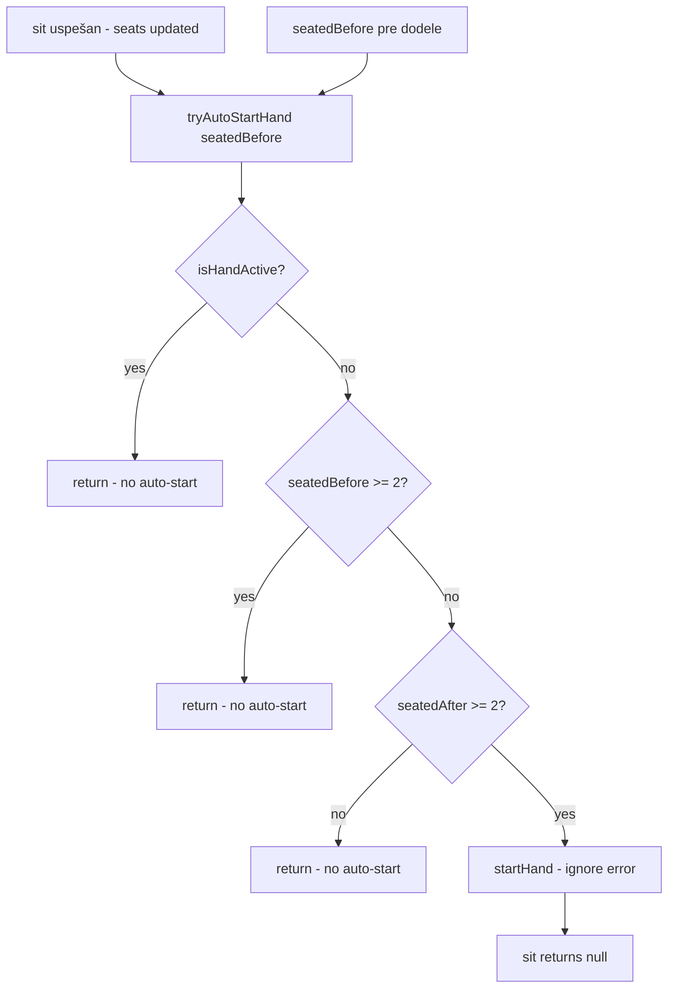

# Zadatak 1: Auto-start ruke — precizirani edge case-ovi

## Scope (potvrđeno)

- Auto-start **samo** pri prelasku **< 2 → ≥ 2** sedećih igrača
- **Ne** auto-start posle završetka ruke (ručno „Nova ruka")
- **Ne** auto-start kada već sede ≥2 igrača (npr. treći sedne posle završene ruke)
- Sedenje tokom aktivne ruke — **van taska**, postojeće ponašanje ostaje
- **Ne dirati:** frontend, Vault/lock/release, env, package, dependency, WS contract, poker engine

---

## Precizna logika implementacije

### `sit()` — redosled (bez izmene vault/check flow-a)

```typescript
async sit(...): Promise<string | null> {
  // 1. checkSit — fail → return error, NEMA auto-start
  // 2. vault verify (ako uključen) — fail → return error, NEMA auto-start
  // 3. checkSit ponovo — fail → return error, NEMA auto-start
  // 4. consumeVaultTx — fail → return error, NEMA auto-start

  const seatedBefore = this.seats.filter(Boolean).length  // PRE dodele

  this.seats[seat] = { playerId, stack: buyIn }            // uspešna dodela

  this.tryAutoStartHand(seatedBefore)                      // POSLE uspešnog sit

  return null  // sit uvek uspešan ako smo stigli ovde
}
```

Auto-start se **nikad** ne poziva na failed `sit` putevima — svi `return err` su **pre** `seatedBefore` / dodele sedišta.

### `tryAutoStartHand(seatedBefore: number): void`

```typescript
private tryAutoStartHand(seatedBefore: number): void {
  if (this.isHandActive()) return

  if (seatedBefore >= 2) return

  const seatedAfter = this.seats.filter(Boolean).length
  if (seatedAfter < 2) return

  this.startHand() // return value se IGNORIŠE — sit ne sme pasti
}
```

### Uslov auto-starta (tačna formula)

Auto-start se dešava **iff**:

```
!isHandActive()
AND seatedBefore < 2
AND seatedAfter >= 2
AND startHand() uspe (interno; ako fail — tiho, sit i dalje OK)
```

**Ključno:** `seatedBefore >= 2` sprečava auto-start na **bilo kom** `sit()` kada sto već ima 2+ igrača — uključujući trećeg igrača posle završene ruke.

### `startHand()` error handling u helperu

- `startHand()` vraća `string | null` — `null` = uspeh, string = greška
- Helper **ne propagira** grešku u `sit()` return
- Klijent **ne dobija** sit error zbog failed auto-start
- Igrači mogu ručno poslati `start-hand` ako auto-start tiho ne uspe

---

## Edge case matrica

| # | Scenario | `seatedBefore` | `seatedAfter` | `isHandActive` | Auto-start? | `sit` rezultat |
|---|----------|----------------|---------------|----------------|-------------|----------------|
| 1 | Prvi igrač sedne | 0 | 1 | false | **Ne** | OK |
| 2 | Drugi igrač sedne | 1 | 2 | false | **Da** | OK |
| 3 | Ručni `start-hand` posle #2 | — | — | true | N/A | N/A; `startHand()` → `'Hand already in progress'` |
| 4 | Posle završene ruke, 2 već sede, treći sedne | 2 | 3 | false | **Ne** | OK (ako nije tokom ruke — trenutno blokirano tokom ruke) |
| 5 | Sedenje tokom aktivne ruke | — | — | true | **Ne** | Fail `'Cannot sit during a hand'` — van taska |
| 6 | `sit` fail — vault/lock | — | — | — | **Ne** | Error pre dodele sedišta |
| 7 | `sit` fail — invalid/taken/already seated | — | — | — | **Ne** | Error pre dodele sedišta |
| 8 | `startHand()` interno fail posle triggera | 1 | 2 | false | Pokušaj → **tiho** | `sit` OK, ruka možda ne startuje |

### Edge case #4 — detalj

```
[a, b] sede → auto-start (1→2)
ruka se završi → finishHand(), table=null, a,b i dalje u seats[]
treći igrač c sedne → seatedBefore=2 → tryAutoStartHand return odmah
ručno „Nova ruka" za sledeću ruku (a,b,c učestvuju u startHand)
```

### Edge case #3 — dupli start

```
Auto-start posle 2. sit → isHandActive()=true
room.startHand() → 'Hand already in progress' (ne null)
hub šalje error klijentu samo za start-hand poruku, ne za sit
```

---

## Test strategija

### Automatski testovi — **obavezno** (EC-1, EC-2, EC-3, EC-4, EC-7)

Novi `it(...)` blokovi u [poker/server/room.test.ts](poker/server/room.test.ts). Bez mock-ova, bez blockchain setup-a, `POKER_SKIP_VAULT_CHECK=1` kao i postojeći testovi.

### **Ne** forsirati kao automatske (EC-5, EC-6, EC-8)

| EC | Razlog | Pokrivenost |
|----|--------|-------------|
| EC-5 | Van taska; postojeći `checkSit` + `isHandActive` | Postojeće ponašanje + ručni QA |
| EC-6 | Zahteva vault/RPC bez skip flag-a | Ručni QA + završni odgovor |
| EC-8 | Zahteva mock engine-a ili veći diff | Helper ignoriše return (kod) + završni odgovor |

### Postojeći testovi — minimalne izmene, **ne brisati agresivno**

Pravilo: zadržati postojeće `it(...)` i njihovu svrhu. Menjati samo ono što pada zbog novog ponašanja.

Fajl: [poker/server/room.test.ts](poker/server/room.test.ts)

| Test | Šta pada | Minimalna izmena |
|------|----------|------------------|
| `sit, start hand, fold wins` | `startHand()` posle 2. sit više nije `null` | Posle 2. sit assert `handInProgress===true`; **ukloniti samo** liniju `assert.equal(room.startHand(), null)` — ostatak testa (fold wins) ostaje |
| `enters showdown phase...` | Redundantni `startHand()` | **Ukloniti samo** `room.startHand()` liniju — loop ne dirati |
| `stand clears seat...` | — | **Bez izmene** |
| `checkSit rejects taken seat` | — | **Bez izmene** (delimično pokriva EC-7 preflight) |
| `removes busted player...` | Redundantni `startHand()` | **Ukloniti samo** `room.startHand()` liniju — busted logika ne dirati |

[poker/src/table.test.ts](poker/src/table.test.ts) — **ne dirati**.

---

## Automatski testovi — specifikacija (EC-1, EC-2, EC-3, EC-4, EC-7)

### EC-1: `first sit does not auto-start`
```typescript
it('first sit does not auto-start', async () => {
  const room = new PokerRoom('test')
  assert.equal(await room.sit('a', 0, 500), null)
  assert.equal(room.snapshot().handInProgress, false)
  assert.equal(room.snapshot().state, null)
})
```

### EC-2: `second sit auto-starts hand`
```typescript
it('second sit auto-starts hand', async () => {
  const room = new PokerRoom('test')
  await room.sit('a', 0, 500)
  assert.equal(await room.sit('b', 1, 500), null)
  const snap = room.snapshot()
  assert.equal(snap.handInProgress, true)
  assert.ok(snap.state)
  assert.notEqual(snap.state!.actionSeat, null)
})
```

### EC-3: `manual startHand after auto-start rejects duplicate`
```typescript
it('manual startHand after auto-start rejects duplicate', async () => {
  const room = new PokerRoom('test')
  await room.sit('a', 0, 500)
  await room.sit('b', 1, 500)
  assert.equal(room.startHand(), 'Hand already in progress')
})
```

### EC-4: `third sit after hand ends does not auto-start`
Koristi isti pattern završetka ruke kao `sit, start hand, fold wins` (fold na action seat):

```typescript
it('third sit after hand ends does not auto-start', async () => {
  const room = new PokerRoom('test')
  await room.sit('a', 0, 500)
  await room.sit('b', 1, 500)
  assert.equal(room.snapshot().handInProgress, true)

  // završi ruku — isti fold/call pattern kao postojeći test
  const state = room.snapshot().state!
  const first = state.players.find((p) => p.seat === state.actionSeat)!
  const second = state.players.find((p) => p.id !== first.id)!
  if (first.betThisRound < state.currentBet) {
    room.applyAction(first.id, { type: 'call' })
    room.applyAction(second.id, { type: 'fold' })
  } else {
    room.applyAction(first.id, { type: 'fold' })
  }
  assert.equal(room.snapshot().handInProgress, false)

  assert.equal(await room.sit('c', 2, 300), null)
  assert.equal(room.snapshot().handInProgress, false)
})
```

### EC-7: `failed sit does not auto-start` (taken seat + already seated)
```typescript
it('failed sit does not auto-start', async () => {
  const room = new PokerRoom('test')
  await room.sit('a', 0, 500)
  assert.notEqual(await room.sit('b', 0, 200), null) // Seat taken
  assert.equal(room.snapshot().handInProgress, false)
  assert.notEqual(await room.sit('a', 1, 200), null) // Already seated
  assert.equal(room.snapshot().handInProgress, false)
})
```

---

## EC-5, EC-6, EC-8 — samo ručno / završni odgovor

| EC | Završni odgovor / Manual QA |
|----|----------------------------|
| EC-5 | `checkSit` i dalje vraća `'Cannot sit during a hand'` — nije menjano |
| EC-6 | Vault lock fail → `sit` error pre `seatedBefore`; ručno sa punim vault flow-om |
| EC-8 | `tryAutoStartHand` ignoriše `startHand()` return; `sit` uvek `null` na uspešnom putu — navesti u Risks/Not run |

---

## Fajlovi za izmenu

| Fajl | Izmena |
|------|--------|
| [poker/server/room.ts](poker/server/room.ts) | `seatedBefore`, `tryAutoStartHand(seatedBefore)`, poziv na kraju `sit()` |
| [poker/server/room.test.ts](poker/server/room.test.ts) | Minimalno ažurirati 3 postojeća + 5 novih automatskih testova (EC-1,2,3,4,7) |

**Ne dirati:** hub.ts, protocol.ts, table.ts, vaultTx.ts, solana/web, env, package

---

## Ručni QA (posle implementacije)

Automatski pokriveni EC-1–4, EC-7 ne moraju ponovo u browseru osim regresije.

| # | Scenario | Automatski? |
|---|----------|-------------|
| 1 | 1 igrač sedne → nema ruke | EC-1 test |
| 2 | 2. igrač sedne → auto-start | EC-2 test |
| 3 | „Nova ruka" dok ruka traje | EC-3 test |
| 4 | Posle ruke, 3. sedne → nema auto-start | EC-4 test |
| 5 | Sedenje tokom ruke → odbijen | **Ručno** (EC-5) |
| 6 | Vault lock fail | **Ručno** (EC-6) |
| 7 | Zauzeto mesto / već sedi | EC-7 test |
| 8 | startHand fail, sit OK | **Završni odgovor** (EC-8) |

---

## Dijagram: `tryAutoStartHand` odluka



---

## Plan implementacije (koraci)

### Korak 1 — `room.ts`
- Dodati `countSeated()` helper ili inline `this.seats.filter(Boolean).length`
- `seatedBefore` pre `this.seats[seat] = ...`
- `tryAutoStartHand(seatedBefore)` posle dodele
- Ignorisati `startHand()` return u helperu

### Korak 2 — `room.test.ts`
- **Postojeći:** minimalno — ukloniti samo redundantne `startHand()` / pogrešne assert-e; zadržati svrhu testova
- **Novi:** 5 automatskih testova — EC-1, EC-2, EC-3, EC-4, EC-7 (vidi specifikaciju iznad)
- **Ne dodavati:** EC-5, EC-6, EC-8 automatske testove

### Korak 3 — `npm run poker:test` — sve PASS (postojeći + 5 novih)

### Procena diff-a
~20 linija `room.ts`, ~70–90 linija testova (5 novih `it` + minimalne izmene 3 postojeća).

---

## Acceptance

- [x] Edge case-ovi precizirani pre implementacije
- [x] Postojeći testovi analizirani
- [ ] Korisnik potvrđuje plan → implementacija
- [ ] `npm run poker:test` PASS
- [ ] `npm run poker:test` — EC-1,2,3,4,7 automatski
- [ ] Ručni QA EC-5, EC-6; EC-8 u završnom odgovoru
