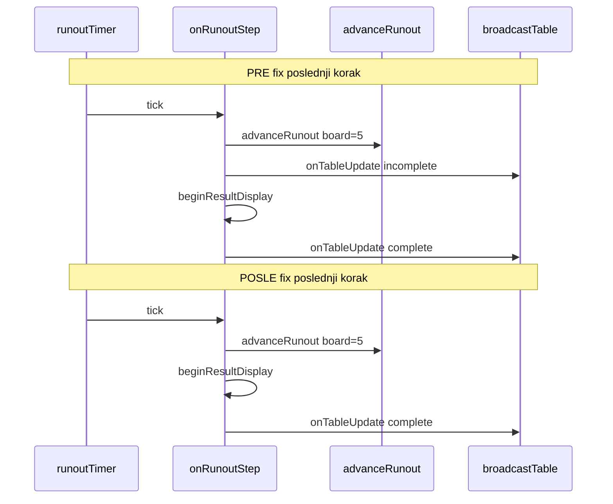

# Poker Showdown Final Runout Update Fix

> **Workspace kopija za pregled u editoru.** Kanonska Cursor plan lokacija: `C:\Users\Pc\.cursor\plans\poker-showdown-final-runout-update-fix.plan.md`

## Kontekst

- **Branch:** `feature/poker-showdown-result-ux`
- **Base:** `fix/poker-short-stack-call-becomes-all-in`
- **Commit-1 osnova:** `007573f` (showdown result UX) — **ne amendovati**
- **Ovaj fix:** novi **commit-2** na istom MR-u (kasniji, odvojen korak)
- **Interim evidence commit-1 (read-only):** `task-evidence/poker-showdown-result-ux/attempts/commit-1/`
- **Interim evidence commit-2:** `task-evidence/poker-showdown-result-ux/attempts/commit-2/`
- **Git HEAD (pre commit-2):** `007573f` — commit-2 **još nije** commitovan

---

## Potvrđeni uzrok problema

**Provereno u aktivnom kodu** — [`poker/server/room.ts`](poker/server/room.ts), `onRunoutStep()`:

```typescript
const r = this.table.advanceRunout()
if (!r.ok) return

this.onTableUpdate?.()                    // broadcast #1

if (r.state.handComplete) {
  this.clearRunoutTimer()
  this.beginResultDisplay(...)            // broadcast #2 (unutar beginResultDisplay)
  return
}
```

Na **poslednjem** staged runout koraku (river, board 4→5 + engine `showdown()`):

| Broadcast | board | handComplete | resultKind | showdownEndsAt | resultDurationMs | showdown result UX UI |
|-----------|-------|--------------|------------|----------------|------------------|-----------|
| 1. iz `onTableUpdate()` | 5 | true | null | null | null | **Nedostaje** result panel, winner highlight, countdown |
| 2. iz `beginResultDisplay()` | 5 | true | showdown | set | SHOWDOWN_MS | Kompletan |

Oba se šalju **sinhrono u istom call stack-u** (isti `setTimeout` callback), bez namernog kašnjenja između njih.

### Precizan opis trenutnog problema

Nepotpun **prvi** terminalni snapshot **već može imati**:

- `board=5`
- `winners` i `handRank` (engine `showdown()`)
- revealed hole cards (`showdownReveal=true` u engine state-u)

Ali **nema showdown result UX metadata**:

- `resultKind=null`
- `showdownEndsAt=null`
- `resultDurationMs=null`

Zato na klijentu posle showdown result UX **nedostaju**:

- result panel (`resultPhase` gate u [`showdown.ts`](solana/web/src/poker/showdown.ts))
- winner seat highlight
- countdown (`ShowdownBar`)

Engine podaci mogu biti prisutni; **showdown result UX result/countdown UI** nije.

**Frontend posle showdown result UX:** `isResultDisplayActive()` zahteva `resultKind !== null && handComplete`.

---

## Šta je postojalo pre showdown result UX

**Provereno u Git istoriji** (`a5cd4b3`, `4d2df34`, blame):

- Staged locked runout uveden u **`a5cd4b3`** (2026-06-12).
- `onRunoutStep()` od tada ima opšti obrazac: `onTableUpdate()` posle **svakog** `advanceRunout()`, uključujući poslednji korak.
- Pre commit-1 poslednji korak šalje dva board=5 emit-a (drugi iz `beginShowdown()`).
- Commit **`007573f`** uveo `beginResultDisplay()` + `resultKind`/`resultDurationMs`, ali **nije promenio redosled** u `onRunoutStep()`.
- Pre showdown result UX frontend je maskirao gap preko `localShowdownEndsAt` — uklonjeno u commit-1.

---

## Zašto prvi finalni broadcast nema posebnu funkciju

- `onTableUpdate()` posle svakog `advanceRunout()` služi za **intermediate** board growth (4, ne-terminalni koraci).
- Na **finalnom** koraku isti pattern redundantly emituje pre `beginResultDisplay()`.
- Fazna granica između ulica u produkciji je **`RUNOUT_STREET_MS` (1200 ms)**, ne između dva sinhrona emit-a na board=5.
- `drainRunout()` (`runoutStreetMs <= 0`) ide direktno u result display — jedan terminalni broadcast.

**Zaključak:** prvi finalni broadcast je **slučajna posledica** opšteg runout pattern-a, ne nameran UX za ovaj commit.

---

## River / result UX odluka (commit-2)

### Product odluka za ovaj commit

- **Server** odmah šalje **jedan kompletan authoritative terminalni snapshot**.
- Snapshot sadrži: `board=5`, reveal, winners, `handRank`, `resultKind`, `showdownEndsAt`, `resultDurationMs`.
- **Frontend** odmah prikazuje rezultat i postojeću river animaciju (CSS `card-deal` na board kartama).
- **Nema** posebne namerne pauze između rivera i result panela u ovom commit-u.

### Van scope-a commit-2 (buduća UX odluka)

- Frontend-only kozmetički polish (fade/transition) može kasnije bez menjanja server countdown-a.
- Prava sinhronizovana pauza river → rezultat bila bi **poseban budući UX task**.
- Takva pauza bi verovatno zahtevala server-authoritative reveal vreme/fazu da svi klijenti ostanu sinhronizovani.
- Ponašanje drugih online poker klijenata tretirati kao **product UX inspiraciju**, ne kao formalno poker pravilo.

Uklanjanje nepotpunog server snapshot-a **ne sprečava** budući frontend-delay prikaza iz već primljenog kompletnog stanja.

---

## Tačan minimalni scope

1. U `onRunoutStep()`: kada `r.state.handComplete === true`, **ne** pozivati `onTableUpdate()` pre `beginResultDisplay()`.
2. Finalni emit isključivo kroz `beginResultDisplay()`.
3. Intermediate koraci (board 4) i dalje pozivaju `onTableUpdate()` pre schedule sledećeg koraka.
4. Dopuniti **samo** postojeći test `'staged runout broadcasts board growth 3 to 4 to 5'`.
5. **Ne** dodavati nove HU ili 4–6 player room testove.
6. **Ne** menjati frontend u ovom commit-u.
7. Predvideti **oba** obavezna manual QA scenarija pre finalnog acceptance-a showdown result UX.

---

## Fajlovi koji će se menjati

**Scope koda:** 2 tracked fajla — jedan produkcijski i jedan test fajl.

| Fajl | Promena |
|------|---------|
| [`poker/server/room.ts`](poker/server/room.ts) | Reorder u `onRunoutStep()` (~5 linija) |
| [`poker/server/room.test.ts`](poker/server/room.test.ts) | Dopuna postojećeg staged runout testa |

**Ne dirati:** frontend, hub, engine, protocol, env, package fajlovi, evidence folderi.

---

## Pravilo za test komande

**Ne izmišljati niti samostalno sastavljati fokusiranu test komandu.**

Plan ne koristi poseban `-t` / filter / grep run — za fail-before i pass-after proveru uvek:

```bash
npm run poker:test
```

Ako suite pokaže pad koji **nije** očekivani novi staged-runout assertion:

- **odmah STOP**
- prijavi tačan test i output
- **ne popravljaj** unrelated problem bez nove korisničke odluke

---

## Koraci implementacije

Redosled je obavezan (TDD za bug fix):

### 1. `poker/server/room.test.ts` — dodati **samo** nove assertion-e

Dopuniti `'staged runout broadcasts board growth 3 to 4 to 5'` (detalji u sekciji Test plan).

**Još nema fix-a u `room.ts`.**

### 2. Fail-before — `npm run poker:test`

```bash
npm run poker:test
```

- **Očekivani FAIL** na starom kodu (novi assertion hvata postojeći bug).
- **Sačuvati stvarni terminal output** kao dokaz (tačan test i poruka).
- Ako pad nije od novih assertion-a → **STOP** (vidi Pravilo za test komande).

### 3. `poker/server/room.ts` — `onRunoutStep()`

```typescript
const r = this.table.advanceRunout()
if (!r.ok) return

if (r.state.handComplete) {
  this.clearRunoutTimer()
  this.beginResultDisplay(this.table.isShowdownReveal() ? 'showdown' : 'fold')
  return
}

this.onTableUpdate?.()

if (this.table.isRunoutPending()) {
  this.scheduleRunoutStep()
}
```

**Zašto je river siguran:** `advanceRunout()` mutira engine state pre bilo kog broadcast-a.

### 4. Pass-after — `npm run poker:test`

```bash
npm run poker:test
```

- **Ne tvrditi PASS** bez stvarnog terminal output-a.
- **Prijaviti tačan broj testova** iz stvarnog loga (npr. `98 passed`).
- Ako pad nije očekivani staged-runout assertion → **STOP**, prijavi tačan test; **ne popravljaj** unrelated problem bez nove korisničke odluke.

### 5. Manual QA (pre finalnog acceptance-a showdown result UX)

Oba scenarija iz sekcije Manual QA — **ne sada**, nego posle automatskih testova.

### 6. Commit-2 (kasniji korak)

- **Ne commitovati** tokom implementacije bez **posebnog korisničkog zahteva**.
- Commit-2 tek posle review-a i PASS testova.
- **Ne amendovati** `007573f`.

---

## Test plan

Usaglašeno sa [`AI_TESTING_AND_ACCEPTANCE_RULES.md`](AI_TESTING_AND_ACCEPTANCE_RULES.md): realan `startHand()` + `applyAction()` flow, bez nameštanja internog state-a, bez lažnog coverage-a.

### Šta postojeći helper stvarno pokriva

**Provereno u kodu:** `driveThreeWayLockedRunout()` seda a, b, c redom:

1. `sit a` → 1 igrač
2. `sit b` → **ruka startuje** (samo a+b u `state.players`)
3. `sit c` → **c je waiting**, van trenutne ruke

Room test pokriva **HU in-hand staged locked runout** (a+b, c waiting za stolom) — **isti `onRunoutStep` path** kao pravi 3 in-hand, ali **ne dokazuje** 3 igrača u istoj ruci. To pokriva manual QA scenario B.

Unit test **nema `PokerHub`** — `applyAction()` ne trigeruje hub `broadcastTable`.

### Razdvojiti dokazne strukture

| Struktura | Šta meri | Odakle dolazi board=3 |
|-----------|----------|------------------------|
| `seenBoardLengths` (`Set<number>`) | Board redosled 3→4→5 | **3** = post-lock snapshot posle `driveThreeWayLockedRunout()` (linija `seenBoardLengths.add(room.snapshot()...)`) — **NIJE** `onTableUpdate` emit |
| `snapshots[]` | **Isključivo** `room.onTableUpdate` emit-i | Očekivano: board **4**, zatim board **5** (posle fix-a: tačno **jedan** board=5) |

**Ne predstavljati board=3 kao `onTableUpdate` emit.**

### Determinističko čekanje

Koristiti postojeći helper `waitForRunoutTimer()` ([`room.test.ts`](poker/server/room.test.ts): `runoutWait = runoutStreetMs + 50` = 100ms).

Posle `driveThreeWayLockedRunout()`:

```typescript
seenBoardLengths.add(room.snapshot().state!.board.length) // board=3 posle lock-a

await waitForRunoutTimer() // turn: board=4 onTableUpdate emit
await waitForRunoutTimer() // river+result: board=5 onTableUpdate emit (posle fix-a)
```

While petlja sa 2000ms deadline **ne koristiti kao primarni mehanizam**. Dozvoljen samo kao dokumentovani fallback ako posle 2× `waitForRunoutTimer()` snapshot još nema `resultKind`, sa `assert.fail` i jasnom porukom.

### Obavezni assertion-i

**Board redosled (seenBoardLengths):**

```typescript
assert.ok(seenBoardLengths.has(3))
assert.ok(seenBoardLengths.has(4))
assert.ok(seenBoardLengths.has(5))
```

**Obavezan invariant — tačno jedan board=5 onTableUpdate emit:**

```typescript
const board5Emits = snapshots.filter((s) => s.state?.board.length === 5)
assert.equal(board5Emits.length, 1)
```

**Prvi (i jedini) board=5 emit — kompletan showdown result UX + engine terminalni contract:**

```typescript
const terminal = board5Emits[0]!
assert.equal(terminal.resultKind, 'showdown')
assert.ok(terminal.showdownEndsAt)
assert.equal(terminal.resultDurationMs, SHOWDOWN_MS)
assert.ok(terminal.state!.winners.length >= 1)
assert.ok(terminal.state!.winners.every((w) => w.handRank))
```

**Nijedan handComplete=true emit bez resultKind:**

```typescript
for (const snap of snapshots) {
  if (snap.state?.handComplete) {
    assert.notEqual(snap.resultKind, null)
    assert.ok(snap.showdownEndsAt)
    assert.equal(snap.resultDurationMs, SHOWDOWN_MS)
  }
}
```

**Zadržati postojeće:** finalni `room.snapshot()` `resultKind`, `showdownEndsAt`, `room.youState('a').canAct === false`.

**`SHOWDOWN_MS`:** koristiti import iz `./room.js` — postojeći pattern u room.test.ts.

### Fail-then-pass protokol

Obavezni redosled — **uvek** `npm run poker:test`, bez fokusirane komande:

1. Dodati **samo** nove assertion-e u postojeći staged runout test
2. `npm run poker:test` → **FAIL** na starom kodu; sačuvati stvarni output
3. Minimalni fix u `room.ts`
4. `npm run poker:test` → **PASS**; prijaviti stvarni broj testova iz loga
5. Unrelated pad u bilo kom koraku → **STOP + prijava**, bez samostalnog fix-a

Frontend build **nije potreban** — fix je server-only.

---

## Manual QA (obavezno pre finalnog acceptance-a showdown result UX)

**Ne izvršavati u Plan fazi.** Zapisati tek posle stvarnog izvršenja; inače `NOT RUN`. Ne označavati PASS bez stvarnog QA.

### Preduslovi (oba scenarija)

- `npm run poker:server` + `npm run solana:web`
- `POKER_SKIP_VAULT_CHECK=1` / `VITE_POKER_SKIP_VAULT_CHECK=1`
- Dev SOL + vault chips na svim wallet-ima

---

### A. HU 2-player staged locked runout (obavezno)

**Preduslovi:**

- **2 Chrome profila**, 2 različita Phantom wallet-a

**Potvrda `onRunoutStep` path-a:**

- **Jedan deep-stack active + jedan short-stack all-in** — **NIJE** scenario gde su oba igrača all-in (taj path daje instant board=5).

**Setup:**

1. Profil A: seat 0, buy-in **500**
2. Profil B: seat 1, buy-in **100**
3. Do locked runout-a: npr. B all-in, A call (ili A raise → B all-in → A call)

**Proveriti:**

- [ ] Board **3 → 4 → 5** sa vidljivim kašnjenjem između ulica (~`RUNOUT_STREET_MS` = 1200ms)
- [ ] Posle rivera: odmah result panel, winner, rank, countdown — bez perioda bez showdown result UX UI
- [ ] **Oba** profila vide isti board, winner, rank i countdown
- [ ] Posle ~5s: cleanup i auto-next

---

### B. Pravi 3-player in-hand staged locked runout (obavezno)

**Preduslovi:**

- **3 Chrome profila**, **3 različita Phantom wallet-a** (dostupni)

**Multi-hand setup (obavezno — auto-start na 2. sedenju sprečava 3 in-hand u prvoj ruci):**

1. Profil A: `sit` seat 0 (deep stack, npr. **500**)
2. Profil B: `sit` seat 1 (npr. **200**) → **prva ruka automatski počinje** (samo A+B u ruci)
3. Profil C: `sit` seat 2 (short, npr. **50**) → **waiting** tokom prve ruke
4. Završiti **prvu ruku** (fold ili check-down — setup korak)
5. Posle result perioda + auto-next: **druga ruka** sa **A, B i C** u ruci
6. U drugoj ruci do locked runout-a:
   - C all-in, B all-in (short), A call (ili raise pa call)
   - **Jedan deep-stack active**, **dva short-stack all-in**

**Proveriti:**

- [ ] Board **3 → 4 → 5** sa kašnjenjem između ulica
- [ ] Posle rivera: odmah result panel, winner, rank, countdown na **sva tri** profila
- [ ] **Sva tri** klijenta vide isti board, winner, rank i countdown
- [ ] Posle ~5s: cleanup i auto-next

---

## Regresioni rizici

| Scenario | Rizik | Pokrivenost |
|----------|-------|-------------|
| HU in-hand staged runout (room test) | Nizak — cilj fix-a | Dopunjen staged runout test |
| Intermediate board=4 emit | Nizak — netaknut | `seenBoardLengths.has(4)` |
| HU oba-all-in (instant board=5) | **Nema** — van `onRunoutStep` | Manual QA commit-1 PASS |
| Pravi 3 in-hand staged runout | Nizak — ista `onRunoutStep` logika | Manual QA scenario B |
| 4–6 player locked runout | Nizak — ista logika | Engine testovi; room emit van scope-a |
| Fold / check-down bez runout-a | **Nema** | Postojeći fold/showdown room testovi |
| `drainRunout` (`runoutStreetMs=0`) | **Nema** | Većina room testova |
| Reconnect posle fix-a | Poboljšanje — manje incomplete terminal stanja | Nije automatski testiran |
| Auto-next / result timer | **Nema** | Postojeći lifecycle testovi |
| River + result istovremeno (commit-2 UX) | Prihvatljivo po product odluci | Manual QA oba scenarija |

---

## Acceptance kriterijumi

### Server / kod

- [x] `onRunoutStep()` ne emituje `handComplete=true` snapshot bez `resultKind`
- [x] Tačno **jedan** `onTableUpdate` emit sa `board.length === 5`, sa kompletnim metadata
- [x] Terminalni snapshot sadrži: board=5, reveal, winners, `handRank`, `resultKind`, `showdownEndsAt`, `resultDurationMs`
- [x] Board redosled 3→4→5 netaknut (`seenBoardLengths`)
- [x] Nema izmena van `room.ts` i `room.test.ts`

### Testovi

- [x] Novi assertion-i dodati **pre** fix-a (samo `room.test.ts`)
- [x] `npm run poker:test` **FAIL** na starom kodu — `staged runout broadcasts board growth 3 to 4 to 5`, `board5Emits.length`: **2 !== 1** (97 pass / 1 fail od 98)
- [x] Minimalni fix u `room.ts` — reorder u `onRunoutStep()`
- [x] `npm run poker:test` **PASS** posle fix-a — **98 pass / 0 fail** (`poker-test-pass-98-of-98.log`)
- [x] **Nema** izmišljene fokusirane test komande — uvek `npm run poker:test`
- [x] Test cleanup: `forceFinishResultDisplay(room)` na kraju staged runout testa

### Manual QA (commit-2 obavezna)

- [x] **A.** HU 2-player staged locked runout — PASS (vidi `attempts/commit-2/manual-qa.md`)
- [x] **B.** Pravi 3-player in-hand staged locked runout — PASS (vidi `attempts/commit-2/manual-qa.md`)

### Git / evidence

- [ ] Commit-2 tek na **eksplicitan korisnički zahtev** — **još nije commitovan**
- [x] **Ne amendovati** `007573f`
- [x] **Ne dirati** `task-evidence/poker-showdown-result-ux/attempts/commit-1/`
- [ ] **Ne kreirati** finalni task evidence root pre korisničke potvrde celog showdown result UX
- [x] Interim evidence commit-2: `task-evidence/poker-showdown-result-ux/attempts/commit-2/`

---

## Git, commit i evidence pravila

- **Ne commitovati** tokom implementacije bez posebnog korisničkog zahteva.
- **Commit-2** je kasniji, odvojen korak posle review-a i PASS testova.
- **Ne amendovati** commit-1 (`007573f`).
- **Ne dirati** interim evidence: `task-evidence/poker-showdown-result-ux/attempts/commit-1/`
- **Ne kreirati** finalni evidence folder pre korisničke potvrde celog showdown result UX.
- Unrelated `npm run poker:test` pad: **STOP**, prijavi tačan test, **ne popravljaj** bez nove korisničke odluke.

---

## Not changed

- [`solana/web/`](solana/web/) — frontend, ShowdownBar, PokerPlay, ws parser (commit-2)
- [`poker/server/hub.ts`](poker/server/hub.ts)
- [`poker/src/table.ts`](poker/src/table.ts) — engine, pot accounting, hand rank
- [`poker/src/protocol.ts`](poker/src/protocol.ts), [`poker/src/types.ts`](poker/src/types.ts)
- `.env`, `.env.example`
- `package.json`, `package-lock.json`, dependency-ji
- Anchor / IDL / Vault / wallet flow
- `task-evidence/poker-showdown-result-ux/attempts/commit-1/` — interim evidence
- Finalni task evidence folder
- Novi HU / 4–6 player room testovi
- Budući river→result UX polish / server-authoritative reveal faza
- Frontend fallback za stari server

---

## Tok poruka (pre vs posle fix-a)



---

## Commit-2 implementacija — stvarni rezultat

**Datum evidence:** 2026-06-22  
**Branch:** `feature/poker-showdown-result-ux`  
**HEAD (pre commit-2):** `007573f`

### Promenjeni fajlovi

**Scope koda:** 2 tracked fajla — jedan produkcijski i jedan test fajl.

| Fajl | Promena |
|------|---------|
| `poker/server/room.ts` | Reorder u `onRunoutStep()` — preskočen `onTableUpdate()` kada je `handComplete=true`; terminalni emit samo kroz `beginResultDisplay()` |
| `poker/server/room.test.ts` | Dopunjen `'staged runout broadcasts board growth 3 to 4 to 5'`; `seenBoardLengths` + `snapshots[]`; `waitForRunoutTimer()` ×2; `forceFinishResultDisplay()` cleanup |

### Test-first FAIL (pre fix-a)

```bash
npm run poker:test
```

- **Rezultat:** 97 pass, **1 fail** (98 ukupno)
- **Pad:** `PokerRoom locked runout` → `staged runout broadcasts board growth 3 to 4 to 5`
- **Assertion:** `board5Emits.length === 1`, **actual: 2** (`2 !== 1` at `room.test.ts:1324`)

### Pass posle fix-a

```bash
npm run poker:test
```

- **Rezultat:** **98 pass, 0 fail**
- **Evidence log:** `task-evidence/poker-showdown-result-ux/attempts/commit-2/poker-test-pass-98-of-98.log`

### Manual QA

- **Scenario A (HU staged locked runout):** PASS — `attempts/commit-2/manual-qa.md`
- **Scenario B (3-player in-hand staged locked runout):** PASS — `attempts/commit-2/manual-qa.md`
- QA sa `POKER_SKIP_VAULT_CHECK=1` / `VITE_POKER_SKIP_VAULT_CHECK=1` — pun Vault flow nije testiran

### Frontend build

**NOT RUN** — nije potreban; commit-2 je server-only (`room.ts`, `room.test.ts`).

### Git status

- Commit-2 **nije** napravljen
- `007573f` **nije** amendovan
- Push **nije** izvršen

---

## Reference

- [`AI_TESTING_AND_ACCEPTANCE_RULES.md`](AI_TESTING_AND_ACCEPTANCE_RULES.md)
- Analiza duplog emit-a: prethodni Plan/ASK chat na `feature/poker-showdown-result-ux`
- Commit-1 plan (read-only): `task-evidence/poker-showdown-result-ux/attempts/commit-1/poker-showdown-result-ux.plan.md`
