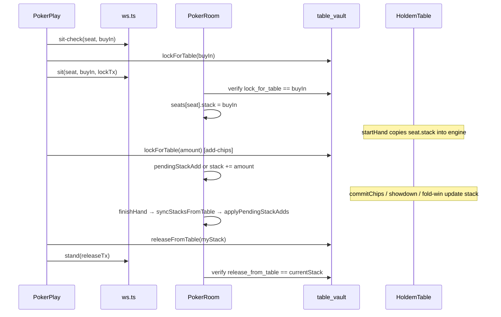

# Vault / poker stack alignment — analiza i plan

## Current behavior

### End-to-end flow (aktivni kod)



### Relevantni fajlovi

| Sloj | Fajl | Uloga |
|------|------|-------|
| Frontend sit/stand | [`solana/web/src/poker/PokerPlay.tsx`](solana/web/src/poker/PokerPlay.tsx) | `handleSit` → `lockForTable(buyIn)`; `handleStand` → `releaseFromTable(myStack)`; `handleAddChips` → lock + refund pattern |
| Frontend vault TX | [`solana/web/src/vault/tableVault.ts`](solana/web/src/vault/tableVault.ts) | `lockForTable` / `releaseFromTable` — whole chips → raw `u64` |
| Frontend WS | [`solana/web/src/poker/ws.ts`](solana/web/src/poker/ws.ts) | `sit-check`, `sit`, `add-chips`, `stand` |
| Protocol | [`poker/src/protocol.ts`](poker/src/protocol.ts) | `stand` šalje samo `releaseTx?` — **iznos nije u WS poruci** |
| Server room | [`poker/server/room.ts`](poker/server/room.ts) | `sit`/`addChips`/`stand`, `currentStack()`, `pendingStackAdd` |
| Server verify | [`poker/server/vaultTx.ts`](poker/server/vaultTx.ts) | Dekodira on-chain `amount` i poredi sa server očekivanjem |
| On-chain | [`solana/programs/table-vault/src/lib.rs`](solana/programs/table-vault/src/lib.rs) | `lock_for_table` debit, `release_from_table` credit — **accounting only** |
| Engine | [`poker/src/table.ts`](poker/src/table.ts) | `stack` / `betThisHand`, showdown, side pots |

### Odgovori na 12 analitičkih tačaka

1. **`sit-check`** — [`room.checkSit`](poker/server/room.ts): seat prazan, `buyIn` pozitivan integer, igrač nije već seated. **Nema vault logike.** Dozvoljeno sedenje tokom aktivne ruke (waiting sit — vidi [`task-evidence/poker-allow-sit-during-hand`](task-evidence/poker-allow-sit-during-hand/poker-allow-sit-during-hand.plan.md)).

2. **Frontend `lockForTable` pri sedenju** — [`PokerPlay.handleSit`](solana/web/src/poker/PokerPlay.tsx): `sit-check` → `lockForTable(chipAmountNum)` → `sitAndWait`. Na grešku posle lock-a: `releaseFromTable(chipAmountNum)` refund.

3. **Lock iznos** — tačno `buyIn` (ceo broj chipova). Server verifikuje `lock_for_table` amount == `buyIn`.

4. **Server pamti stack** — `Seat { stack, pendingStackAdd, rebuyDeadlineAt }`. Posle `sit`: `stack = buyIn`. Posle ruke: `syncStacksFromTable()` prepisuje iz engine-a. Add-chips tokom ruke ide u `pendingStackAdd`.

5. **Engine menja stack** — gubitak = `commitChips` (stack ↓, betThisHand ↑). Dobitak = showdown `splitPot` ili fold-win `awardToSingleWinner` (stack ↑). Side pots utiču **ko dobija koji pot**, ne mehanizam commit-a.

6. **Frontend `releaseFromTable`** — [`handleStand`](solana/web/src/poker/PokerPlay.tsx): `releaseFromTable(myStack)` ako `myStack > 0` i vault check uključen.

7. **Release iznos** — `myStack` na frontendu; `currentStack(seat)` na serveru. Isti izvor logike: live engine `stack` ako je igrač u ruci/showdown-u, inače `seat.stack`.

8. **Server provera** — DA: `verifyTableVaultTx(..., 'release_from_table', stack)` gde je `stack = currentStack()`. **Ne proverava** sumu lock-ova — proverava jednakost sa poker stack-om.

9. **Winner više od buy-in-a** — DA, namerno: pobednik može `release` > inicijalni lock ako je `stack` porastao. Server zahteva tačan `stack`, ne cap na buy-in.

10. **Loser više nego što mu ostaje** — NE u normalnom flow-u: gubitnik sa `stack=0` ne šalje release TX. Server ne zahteva release ako `stack <= 0`.

11. **Heads-up vs 3–6** — Ista logika po igraču; side-pot samo raspodeljuje potove. Nema heads-up-specifičnog bug-a u release mehanizmu.

12. **All-in / side-pot / folded** — Folded igrač ostaje u engine-u do kraja ruke → ne može `stand` dok je u ruci. Side-pot menja raspodelu na showdown-u; `stand` release koristi finalni `stack` posle `finishHand`. Uncalled bet refund vraća u `stack` pre showdown-a ([`task-evidence/poker-uncalled-bet-refund`](task-evidence/poker-uncalled-bet-refund/poker-uncalled-bet-refund.plan.md)).

### Šta **nije** testirano sa vault-om

Svi [`poker/server/room.test.ts`](poker/server/room.test.ts) testovi postavljaju `POKER_SKIP_VAULT_CHECK=1` (linija 5). **Nema automatskih testova** za `verifyTableVaultTx` integraciju.

---

## Problem / risk

### Da li je bug stvaran?

| Kategorija | Status |
|------------|--------|
| Osnovni model (release = poker stack) | **Već implementiran** i konzistentan FE ↔ server |
| Winner release > buy-in | **Namerno**, ne bug |
| Loser sa stack=0 bez release | **Ispravno** |
| Chip conservation u engine-u | Testirano (`chipTotal` invariant) |
| **`pendingStackAdd` pri stand-u** | **Stvaran edge-case bug** |
| On-chain uncapped `release_from_table` | **Dizajn rizik** (bypass servera) |
| Vault-enabled E2E | **Nema pokrivenosti** |

### Reprodukcija `pendingStackAdd` bug-a

1. Dva igrača igraju aktivnu ruku.
2. Treći igrač **waiting sit** (dozvoljeno) — lock `buyIn=200`, `stack=200`, nije u engine-u.
3. Treći igrač **add-chips tokom ruke** — lock `100`, `pendingStackAdd=100` (stack i dalje 200 u snapshot-u).
4. Treći igrač **ustane pre sledeće ruke** (dozvoljeno — nije `isPlayerInCurrentHand`).
5. `currentStack` → `200` (ne uključuje `pendingStackAdd`).
6. `release_from_table(200)` — **100 chipova ostaje zaključano u vault accounting-u bez release-a.**

Frontend `myStack` takođe ne vidi `pendingStackAdd` (namerno skriveno iz snapshot-a — vidi [`task-evidence/poker-add-chips`](task-evidence/poker-add-chips/poker-add-chips.plan.md)).

### Ko može dobiti pogrešan balance?

- **Igrač koji stand-uje sa `pendingStackAdd > 0`** — gubi locked chipove (under-release).
- **Direktan on-chain poziv** `release_from_table` bez servera — može inflirati `user_balance` (van poker flow-a; program nema cap).
- **Winner/loser u standardnom 2–6 player flow-u bez pending edge-a** — **nema dokazanog bug-a** u aktivnom kodu.

---

## On-chain/off-chain accounting model

| Pojam | Značenje u ovom projektu |
|-------|--------------------------|
| **Locked amount** | Zbir svih `lock_for_table` TX-ova (sit + add-chips). Debituje `user_balance` PDA. **Nema** posebnog on-chain „table lock“ polja. |
| **Current poker stack** | `HoldemTable.player.stack` tokom ruke; `seat.stack` između ruku. Samo **necommitted** chipovi (ne `betThisHand`). |
| **Net profit/loss** | `current_stack - sum(locks)` nije eksplicitno praćeno; implicitno kroz razliku stack-a posle igre. |
| **Šta sme release** | `currentStack + pendingStackAdd` (pending je locked ali još nije u stack-u). Loser sa `stack=0`: release `0` (bez TX). |

### Odgovori na posebna pitanja

1. **Da li program podržava release > inicijalni lock?** — **DA.** `release_from_table` samo dodaje na `user_balance`; nema provere prema prethodnim lock-ovima.

2. **Odakle winner-ov dodatni dobitak on-chain?** — Iz **accounting pool-a**: gubitnici su imali lock debit, ali ne rade release; winner-ov veći release kredituje razliku. SPL tokeni ostaju u vault ATA (lock/release ne pomeraju SPL).

3. **Interni prenos ili program ne podržava?** — **Interni vault accounting** — nema table-level settlement instrukcije, nema transfera između user PDAs na chain-u. Prenos je implicitan kroz asimetriju lock/release po igračima, uz server koji nameće `release == stack`.

4. **Dovoljno server/frontend ili treba on-chain net settlement?** — Za trenutni model: **dovoljno je uskladiti server + frontend release iznos sa poker stack-om (+ pending)**. On-chain net settlement bi bio potreban samo za trustless enforcement bez servera.

5. **Minimalni modeli:**
   - **release samo current stack** — već implementirano; treba +pending fix
   - **release locked + net profit** — ekvivalentno ako je stack tačan
   - **table-level settlement** — veliki scope (Anchor + WS); nije potrebno za kriterijume
   - **stand-check preflight** — alternativa za iznos bez širenja `youState`

6. **Najmanje izmena:** Fix `releasableStack = currentStack + pendingStackAdd` na serveru + izložiti isti iznos frontendu (vidi Options).

7. **Rizik samo frontend promene:** **Visok / beskoristan** — server je autoritativan (`verifyTableVaultTx` poredi sa **svojim** `stack`, ne sa klijentskim poljem). Frontend-only promena bez server usklađivanja → verify fail. Frontend-only sa većim iznosom od server stack-a → reject.

---

## Options

### Opcija A: Fix `pendingStackAdd` u `stand()` + `you.releasableStack` (preporučeno)

**Šta menja:** Server računa `releasableStack(seat)`; `stand()` verifikuje taj iznos; `youState` ili `YouState` dobija `releasableStack` za frontend potpis; `PokerPlay` koristi to umesto `myStack` za release.

**Fajlovi:**
- [`poker/server/room.ts`](poker/server/room.ts) — helper `releasableStack()`, `stand()` koristi ga
- [`poker/src/protocol.ts`](poker/src/protocol.ts) — opciono polje `you.releasableStack` (ili `standReleaseChips`)
- [`solana/web/src/poker/PokerPlay.tsx`](solana/web/src/poker/PokerPlay.tsx) — release iznos iz `you` state
- [`solana/web/src/poker/ws.ts`](solana/web/src/poker/ws.ts) — tip za `YouState`

**Prednosti:** Minimalan diff; ne dira Anchor/WS message types za stand; zatvara jedini poznati accounting gap.

**Rizici:** Mora biti sinhronizovano u `table` broadcast-u; igrač mora imati svež snapshot pre potpisa.

**Dira WS/Anchor/Vault flow?** Samo proširenje `YouState` u postojećem `table` message — **ne menja** stand message contract. Ne dira Anchor.

**Minimalan safe diff?** **DA.**

---

### Opcija B: `stand-check` preflight (kao `sit-check`)

**Šta menja:** Novi WS `stand-check` → `stand-check-ok { releaseChips }` → frontend potpis → `stand(releaseTx)`.

**Fajlovi:** `protocol.ts`, `hub.ts`, `ws.ts`, `room.ts`, `PokerPlay.tsx`

**Prednosti:** Eksplicitan server-authoritative iznos neposredno pre TX-a; manje zavisnosti od snapshot timing-a.

**Rizici:** **Menja WS contract** (korisnik je zabranio bez eksplicitne odluke); više fajlova.

**Minimalan safe diff?** NE (WS promena).

---

### Opcija C: Apply `pendingStackAdd` u `stand()` pre compute (samo server)

**Šta menja:** U `stand()`, pre `currentStack`: `seat.stack += seat.pendingStackAdd; pendingStackAdd = 0`.

**Problem:** Frontend i dalje potpisuje `myStack` bez pending → **verify mismatch** ako postoji pending.

**Minimalan safe diff?** **NE** bez frontend usklađivanja.

---

### Opcija D: On-chain table settlement (Anchor program)

**Šta menja:** Nova instrukcija npr. `settle_table` sa PDA table state, per-player net, authority signature.

**Prednosti:** Trustless conservation na chain-u.

**Rizici:** Veliki scope; korisnik eksplicitno zabranio Anchor promene; zahteva novi deploy, IDL sync, QA.

**Minimalan safe diff?** **NE.**

---

### Opcija E: Server praćenje `totalLocked` po igraču

**Šta menja:** `Seat.totalLockedChips` inkrement na sit/add-chips; stand provera `release <= totalLocked + maxPossibleProfit` ili `release == stack && stack <= tableTotal`.

**Prednosti:** Dodatna odbrana od engine grešaka.

**Rizici:** Redundantno ako je engine tačan; ne rešava pending bez Opcije A; više state-a za održavanje.

**Minimalan safe diff?** Delimično — komplikuje bez jasne koristi ako je engine izvor istine.

---

## Recommended minimal plan

**Opcija A** — bez implementacije sada.

### Scope

| Dirati | Ne dirati |
|--------|-----------|
| `poker/server/room.ts` — `releasableStack`, `stand()` | `solana/programs/` (Anchor) |
| `poker/src/protocol.ts` — `YouState.releasableStack` | `.env`, `package.json`, dependencies |
| `solana/web/src/poker/PokerPlay.tsx` — release iznos | `sit-check` → lock → sit redosled |
| `solana/web/src/poker/ws.ts` — tipovi | `HoldemTable` engine (`poker/src/table.ts`) |
| `poker/server/room.test.ts` — novi testovi pending+stand | `vaultTx.ts` logika (osim ako treba unit test fajl) |

### Implementacioni koraci (za Agent mode)

1. Dodati `private releasableStack(seat: number, playerId: string): number` u `room.ts`:
   - `base = currentStack(seat, playerId)`
   - `pending = seats[seat]?.pendingStackAdd ?? 0`
   - return `base + pending`
2. `stand()` koristi `releasableStack` umesto `currentStack` za vault verify.
3. `youState()` dodaje `releasableStack` (samo za seated igrača; `0` ako nije seated).
4. `PokerPlay`: za `handleStand`, koristiti `you.releasableStack` (ili fallback `myStack` dok nema polja).
5. Testovi u `room.test.ts` (vault skip i dalje OK za logiku; opciono mock verify test):
   - waiting sit + add-chips during hand + stand → release amount uključuje pending
   - standard win/loss stand → unchanged behavior
   - stack=0 stand → no release required

### Acceptance criteria

- Pobednik posle stand-a: vault credit = prethodni vault available + `releasableStack` (ne više od poker stack-a).
- Gubitnik sa `stack=0`: stand bez release; vault credit ostaje smanjen za izgubljene lock-ove.
- `pendingStackAdd` uvek uključen u release kada igrač stand-uje.
- Postojeći flow deposit → sit-check → lock → sit → igra → stand → release **nepromenjen** u redosledu i porukama (osim novog optional `you` polja).
- `npm run poker:test` prolazi; novi testovi pokrivaju pending edge-case.
- Ručni QA sa vault check **uključenim** na oba servisa.

---

## Tests / QA plan

### Automatski (predloženo)

**Room testovi** (`npm run poker:test`) — realni flow kroz `sit` → `startHand` → `applyAction` / fold / showdown:

| Test | Scenario |
|------|----------|
| `stand release includes pendingStackAdd` | 3 igrača, waiting sit + add-chips during hand + stand |
| `winner stack after heads-up` | 2 igrača, fold win, stand amount = očekivani stack |
| `loser bust stand no release` | stack=0, stand bez releaseTx (mock vault off) |
| `add-chips between hands then stand` | pending=0, release = stack + winnings |

**Engine testovi** (postojeći) — proširiti samo ako treba per-player stack assert posle multi-way side-pot showdown-a (trenutno gap u [`table.test.ts`](poker/src/table.test.ts)).

**vaultTx unit test** (novi fajl, opciono) — mock TX decode; **ne može** bez RPC/mock chain za punu integraciju.

### Ručni QA (obavezno za vault)

Vault check **uključen** (`VITE_POKER_SKIP_VAULT_CHECK` i `POKER_SKIP_VAULT_CHECK` **nisu** postavljeni):

1. **2 igrača HU:** A buy-in 200, B buy-in 200 → A pobedi → A stand → vault A ≈ start + 400; B stand/kick → vault B smanjen
2. **3 igrača:** jedan winner, dva loser-a — winner release = ukupan table stack
3. **All-in side-pot** (3+ igrača različiti stackovi) — winner main+side, losers 0
4. **Waiting sit + add-chips + stand** — repro pending bug-a pre fix-a, verify posle fix-a
5. **Pokušaj manji release TX** — server reject
6. **Deposit/withdraw** posle stand — vault credit konzistentan

### Šta ne može automatski

- Phantom potpis i devnet TX confirmation
- Puna `verifyTableVaultTx` bez mock RPC / recorded signatures
- Cross-wallet chip conservation na devnet-u bez integration test harness-a

**Napomena:** Ništa od navedenog **nije pokrenuto** u ovoj analizi.

---

## Open decisions for user

1. **`you.releasableStack` vs `stand-check` WS** — da li je proširenje `YouState` prihvatljivo, ili preferirate novi preflight message (menja WS contract)?
2. **Auto-kick (`removeExpiredRebuySeats`)** — busted igrač sa `stack=0` se uklanja bez `release_from_table`. Da li je to OK (gubitnik ne dobija nazad chipove), ili treba eksplicitni release TX pri kick-u?
3. **On-chain uncapped `release_from_table`** — da li ostaviti kao dev trust model (server gate), ili planirati budući Anchor hardening (van trenutnog scope-a)?
4. **Vault integration testovi** — da li uvesti mock-based `vaultTx.test.ts` ili recorded devnet TX fixtures (bez novih dependency-ja)?
5. **Da li postoji poznati produkcioni incident** koji pokreće ovaj task (npr. winner vault balance pogrešan), ili je preventivna analiza? Ako postoji konkretan repro, prioritetizuje se taj scenario.

---

## Task-evidence kontekst

Pročitani/relevantni planovi iz Git istorije:

- [`poker-add-chips`](task-evidence/poker-add-chips/poker-add-chips.plan.md) — `pendingStackAdd` ne curi u snapshot; **uzrok pending/stand gap-a**
- [`poker-add-chips-before-kick`](task-evidence/poker-add-chips-before-kick/poker-add-chips-before-kick.plan.md) — rebuy grace + pending guard
- [`poker-allow-sit-during-hand`](task-evidence/poker-allow-sit-during-hand/poker-allow-sit-during-hand.plan.md) — omogućava stand tokom ruke za waiting igrače
- [`poker-side-pots-ui`](task-evidence/poker-side-pots-ui/poker-side-pots-ui.plan.md) — UI only
- [`poker-uncalled-bet-refund`](task-evidence/poker-uncalled-bet-refund/poker-uncalled-bet-refund.plan.md) — engine chip conservation; **već implementirano, odvojen sloj**

**Zaključak:** Osnovni off-chain/on-chain alignment model je već „release current poker stack“. Jedini potvrđeni gap u aktivnom kodu je **`pendingStackAdd` pri stand-u**. Anchor/WS/Vault flow promene **nisu potrebne** za minimalni safe fix.

---

## Cross-check: `poker-uncalled-bet-refund` MR (potvrđeno)

Ponovna provera aktivnog koda i [`task-evidence/poker-uncalled-bet-refund/poker-uncalled-bet-refund.plan.md`](task-evidence/poker-uncalled-bet-refund/poker-uncalled-bet-refund.plan.md) potvrđuje da je novi predloženi bug **drugačiji problem na drugom sloju** — nije regresija niti duplikat uncalled-bet fix-a.

### Šta je MR `poker-uncalled-bet-refund` rešio

| Aspekt | Detalj |
|--------|--------|
| **Problem** | Uncalled overbet višak ostaje u `betThisHand` → pogrešan pot UI, chip-loss u 4+ player scenarijima |
| **Root cause** | Nedostajući `returnUncalledBets()` u engine-u |
| **Fix** | `returnUncalledBets()` na početku `endBettingRound()` u [`poker/src/table.ts`](poker/src/table.ts) |
| **Scope** | Samo `table.ts` + `table.test.ts` (6 novih testova, 77/77 pass) |
| **Nije dirao** | `room.ts`, `hub.ts`, `protocol.ts`, frontend, vault, WS |

Grep potvrda: `uncalled` / `returnUncalledBets` postoji **samo** u `poker/src/table.ts`; **nema** reference u `room.ts` ni `solana/web`.

### Zašto novi bug nije isti problem

| | `poker-uncalled-bet-refund` | Novi `pendingStackAdd` + stand |
|--|----------------------------|--------------------------------|
| **Sloj** | Hold'em engine (`betThisHand` / `stack` tokom ruke) | Room server + frontend stand/release |
| **Kada** | Tokom betting round-a / pre showdown-a | Pri `stand()` pre `finishHand` primene pending-a |
| **Simptom** | Chip loss / pogrešan pot u engine-u | Locked chipovi (add-chips TX) bez `release_from_table` |
| **Uslov** | Overbet / solo-top uncalled višak | `pendingStackAdd > 0` u trenutku stand-a |
| **Normalan flow posle ruke** | Engine stack tačan posle `syncStacksFromTable` | `applyPendingStackAdds()` spaja pending u stack — **bug ne postoji** ako igrač čeka kraj ruke |

**Potvrđeno:** uncalled-bet MR pokriva overbet / side-pot **chip conservation u engine-u** (refund preraspoređuje `stack` ↔ `betThisHand`, `buildPots` ne dira). To ne utiče na vault lock/release sloj.

### Potvrde korisnikovih tačaka

1. **Uncalled bet MR pokriva overbet / side-pot chip loss** — **DA.** Plan eksplicitno pokriva HU, 3-way locked runout, 4-way refund + conservation, tie-at-top guard, folded matched chips. Implementirano u aktivnom `table.ts` (linije 324–353).

2. **Novi problem samo kada `pendingStackAdd` postoji pri stand-u** — **DA.** Uslov: igrač stand-uje dok je `seats[seat].pendingStackAdd > 0` (tipično: waiting sit + add-chips tokom aktivne ruke + stand pre sledeće ruke). Posle `finishHand()` → `applyPendingStackAdds()` pending je 0 i stand koristi ispravan stack. Standardni win/loss stand **nema** ovaj gap.

3. **Winner `release > buy-in` nije bug** — **DA, očekivano.** Server verifikuje `release == currentStack`, ne cap na sumu lock-ova. Dobitak dolazi iz vault accounting pool-a (gubitnikovi lock debiti bez release-a). Nije povezano sa uncalled-bet fix-om.

4. **Minimalni fix ne dira zabranjene delove** — **DA**, uz preciznu napomenu o `protocol.ts`:

| Komponenta | Dirati? | Napomena |
|------------|---------|----------|
| `poker/src/table.ts` | **NE** | Uncalled-bet MR već završen; engine stack je izvor istine |
| Anchor `table-vault` program | **NE** | `release_from_table` ostaje accounting-only |
| WS `stand` client message | **NE** | Ostaje `{ type: 'stand', releaseTx? }` |
| Vault lock/release flow / redosled sit | **NE** | Samo iznos potpisa na frontendu |
| `poker/src/protocol.ts` | **DA (samo `YouState`)** | Novo polje `releasableStack` u postojećem `table` broadcast-u — **nije** promena `stand` poruke |
| `poker/server/room.ts` | **DA** | `releasableStack()` + `stand()` verify |
| `solana/web/src/poker/PokerPlay.tsx` | **DA** | Release iznos iz `you.releasableStack` |

---

## Deep plan review (2026-06-17) — pre implementacije

### Original task coverage — zaključak

| Kriterijum | Status u aktivnom kodu | Šta plan dodaje |
|------------|------------------------|-----------------|
| Off-chain stack ↔ on-chain lock usklađeni | **DA** za normalan flow (`release == poker stack`) | Fix za `pendingStackAdd` gap |
| Winner ne može više od depozita + dobitka | **DA** — server verifikuje tačan stack, ne više | Isto posle fix-a |
| Loser balance tačan | **DA** — `stack=0` → bez release | Isto |
| Winner ne izvlači previše | **DA** u poker flow-u (server gate) | Isto |
| Loser ne dobija izgubljene chipove | **DA** | Isto |
| Nema zaglavljenih lock-ova | **NE** za pending+stand edge | **Plan rešava** |

**Plan ne rešava (dizajn rizik / budući hardening):**
- On-chain `release_from_table` bez cap-a (bypass servera)
- Nema `totalLockedChips` cross-check-a
- Nema automatskog vault E2E testa (Phantom/devnet)
- Auto-kick bez release za `stack=0` busted (namerno — gubitnik)

### Confirmed bug(s) — finalna lista

**Bug 1 (primarni, reprodukovan u kodu):** `pendingStackAdd` + `stand` dok je ruka aktivna i igrač **nije** u `HoldemTable`.

- **Repro:** A,B u ruci → C waiting sit (300) → C `addChips(100)` tokom ruke → `pendingStackAdd=100` → C `stand` pre sledeće ruke
- **Uzrok:** `stand()` koristi `currentStack()` koji ne uključuje `pendingStackAdd`; `stand` guard `stack > 0` takođe gleda samo `currentStack`
- **Fajlovi:** [`room.ts`](poker/server/room.ts) L277–309, [`PokerPlay.tsx`](solana/web/src/poker/PokerPlay.tsx) L152–157, L387–396
- **Uslov:** `isHandActive() && !isPlayerInCurrentHand() && pendingStackAdd > 0`

**Bug 2 (sekundarni, defanzivni):** Ako bi ikad postojalo `currentStack=0` i `pendingStackAdd>0` pri stand-u, trenutni `if (stack > 0)` **preskače** release TX.

- **Dostižnost u aktivnom kodu:** **Verovatno nedostižno** — jedini `pending` path je tokom aktivne ruke, a tada je igrač u ruci (ne može stand) ili waiting (stack=buyIn>0). Rebuy path ide direktno u `stack`, ne u pending.
- **Preporuka:** `stand()` koristi `releasableStack > 0` za release gate, ne samo `currentStack > 0`.

**Nije bug:** winner `release > buy-in`; loser `stack=0` bez release; uncalled-bet (engine sloj).

### pendingStackAdd — sistematska provera

| Pitanje | Odgovor (iz aktivnog koda) |
|---------|---------------------------|
| Još scenario gde `currentStack` nije dovoljan? | **Samo** `pendingStackAdd > 0` pre `applyPendingStackAdds` |
| `pending` kod igrača u trenutnoj ruci? | **DA** — add-chips tokom ruke ide u `pendingStackAdd` |
| Igrač u engine-u može stand? | **NE** — `isHandActive() && isPlayerInCurrentHand` blokira |
| Waiting igrač add-chips tokom ruke? | **DA** — test `waiting player addChips during hand` |
| Waiting igrač stand pre sledeće ruke? | **DA** — nije u `state.players` |
| `finishHand()` uvek `applyPendingStackAdds()`? | **DA** — L627, pre grace/kick |
| `startHand()` takođe `applyPendingStackAdds()`? | **DA** — L322 (defanzivno, pre novog deal-a) |
| Auto-kick isti problem? | **NE** — kick sa `stack=0` bez release je ispravno za gubitnika; kick **ne radi** ako `pendingStackAdd>0` (L701) |
| Stand posle završene ruke, pending=0? | **DA** — `finishHand` primenjuje pending; izuzetak je samo stand **tokom** aktivne ruke |

### Double-counting analiza

- `pendingStackAdd` **nikad** nije u `seat.stack` dok `applyPendingStackAdds()` ne odradi (L675–676)
- `currentStack()` čita `seat.stack` ili live engine `stack` — **ne uključuje** pending
- `releasableStack = currentStack + pendingStackAdd` **ne može** duplirati u normalnom flow-u
- Guard: **ne** pozivati `applyPendingStackAdds()` u `stand()` pre računanja — samo sabirati, ne mutirati (izbegava race sa `finishHand`)

### hub.ts — ne treba dirati

[`hub.ts`](poker/server/hub.ts) L141–156 već šalje `you: room.youState(playerId)` u `table` poruci. Proširenje `YouState` u `room.youState()` + `protocol.ts` automatski stiže klijentu — **bez izmene hub rutera**.

### Odgovori na 14 pitanja

1. **Plan zadovoljava originalne kriterijume?** Delimično — kriterijumi već važe za normalan flow; plan zatvara **jedini potvrđeni gap** (pending+stand). Ne rešava on-chain trustless hardening.
2. **Winner release > buy-in?** Očekivano kada `poker stack > sum(personal locks)`; dobitak dolazi iz pool-a gubitnikovih lock-ova.
3. **Winner release > real stack?** **NE** u poker flow-u — server `verifyTableVaultTx` odbija mismatch. **DA** ako neko zaobiđe server i potpiše proizvoljan on-chain release (dizajn rizik).
4. **Loser dobija nazad više?** **NE** u poker flow-u — `stack=0` → nema release TX.
5. **Zaglavljeni lock osim pending+stand?** **Nije dokazano** u aktivnom kodu za standardne win/loss flow-ove. Potencijalno teorijski `stack=0`+`pending>0` (Bug 2, verovatno nedostižno).
6. **`releasableStack` duplira?** **NE** — pending nije u `currentStack` dok nije applied.
7. **Pending već u `currentStack`?** **NE** u aktivnom kodu.
8. **Guard za applied pending?** Nije potreban ako se samo sabira; **ne** mutirati seat u `releasableStack()` helperu.
9. **`YouState.releasableStack` dovoljno?** **DA** za minimalni fix; ažurira se na svaki `table` broadcast.
10. **`stand-check` vrednost?** Korisno za stale-snapshot zaštitu, ali **širi WS contract** — nije potrebno za minimalni fix ako frontend čita `you` iz poslednjeg broadcast-a pre potpisa.
11. **`totalLockedChips`?** **Redundantno** ako je engine+room stack izvor istine.
12. **Anchor sada?** **NE** — poseban budući hardening task.
13. **Minimalni test set pre acceptance:** vidi Test matrix ispod — **1 direktan** pending+stand test obavezan; 3–4 regresiona room testa; postojeći engine testovi ostaju.
14. **Ručni QA obavezan:** vault TX sa Phantom, 2-profile winner/loser, pending+stand repro, reject wrong release amount.

### Test matrix (final)

| ID | Test | Scenario | Igrači | Realan flow | Šta proverava | Auto/Ručno | Pre acceptance |
|----|------|----------|--------|-------------|---------------|------------|----------------|
| T1 | `stand release includes pendingStackAdd` **(DIREKTAN)** | waiting sit + add-chips during hand + stand | 3 | sit×3, startHand implicit, addChips, stand | `releasableStack === stack+pending` pre stand | Auto | **DA** |
| T2 | `stand without pending unchanged` | sit, stand bez add | 2 | sit×2 | releasableStack === stack | Auto | **DA** |
| T3 | `add-chips between hands then releasable` | add između ruku, stand | 2 | sit, finishHand, addChips, stand | pending=0, releasable=stack | Auto | **DA** |
| T4 | `HU winner releasable after fold win` | winner veći stack | 2 | sit, startHand, applyAction fold, stand | releasable = winner stack (može > buy-in) | Auto | Regresija |
| T5 | `loser stack 0 stand no release amount` | bust stand | 2 | sit, all-in bust, stand | releasableStack=0 | Auto | Regresija |
| T6 | `waiting addChips next hand top-up` | postojeći | 3 | sit×3, addChips, finishHand | pending applied — **SLIČAN**, ne stand | Auto | Postojeći |
| T7 | 3-way all-in side-pot releasable | winner posle showdown | 3 | sit, startHand, all-in actions, finish, stand | releasable = engine stack | Auto | Regresija (opciono) |
| T8 | 4-way uncalled conservation | engine regresija | 4 | postojeći table.test | chip conservation — **engine**, ne room | Auto | Postojeći |
| T9 | vault HU winner/loser | originalni kriterijumi | 2 | full E2E | vault credit | **Ručno** | **DA** |
| T10 | pending+stand vault E2E | Bug 1 repro | 3 | waiting sit path | locked chips returned | **Ručno** | **DA** |
| T11 | wrong release TX rejected | security | 2 | stand sa manjim TX | server error | **Ručno** | Preporučeno |

**Napomena o postojećim testovima:**
> `waiting player addChips during hand enters next hand with top-up` pokriva **sličan** pending scenario, ali **ne pokriva direktno** stand/release amount — nema assert na `releasableStack` niti stand uopšte.

> `stand clears seat without vault tx` i `stand during grace` pokrivaju **sličan** stand flow, ali **ne proveravaju** release iznos.

### Recommended minimal implementation plan (ažurirano)

**Opcija A** — i dalje preporučena.

**Redosled izmena:**
1. `room.ts`: `releasableStack(seat, playerId)` = `currentStack + pendingStackAdd` (read-only)
2. `room.ts`: `stand()` — koristi `releasableStack` za **i** release gate **i** verify amount
3. `room.ts`: `youState()` — dodaj `releasableStack` za seated igrača
4. `protocol.ts` + `ws.ts`: tip `YouState.releasableStack`
5. `PokerPlay.tsx`: `handleStand` → `releaseFromTable(you.releasableStack ?? myStack)`; prikaži u UI ako relevantno
6. `room.test.ts`: T1–T5 (T1 obavezan direktan); **ne dirati** `table.ts`, `hub.ts`, Anchor, `stand` WS poruku

### Open decisions for user (samo stvarne odluke)

1. **`you.releasableStack` vs `stand-check`** — da li je proširenje `YouState` prihvatljivo?
2. **Auto-kick bez release za busted `stack=0`** — potvrditi da je namerno (gubitnik ne vraća chipove)?
3. **Anchor hardening** — odvojen budući task ili eksplicitno van scope-a?
4. **Ručni vault QA** — ko izvršava pre merge-a?

---

## QA blocker: on-chain release uspeo, server stand nije potvrđen

Manual QA pending+stand repro je pokazao dodatni acceptance blocker:

```text
on-chain release uspešan != server-side stand uspešan / seat uklonjen
```

### Repro

1. A i B sede i igraju aktivnu ruku.
2. C sedne tokom aktivne ruke sa 300 i čeka sledeću ruku.
3. C uradi add-chips još 300 tokom iste A/B ruke (`pendingStackAdd=300`).
4. C klikne Stand i završi Phantom release/stand flow pre kraja A/B ruke.
5. Vault stanje se vrati na očekivano (release 600 verovatno prošao).
6. C vizuelno ostane seated.
7. Posle završetka A/B ruke auto-start ubaci C u sledeću ruku sa 600.

### Root cause iz aktivnog koda

- `PokerPlay.handleStand()` čeka `releaseFromTable(...)`, ali zatim pozove `stand(releaseTx)` fire-and-forget.
- `usePokerWs.stand()` samo šalje `{ type: 'stand', releaseTx }`; nema pending request, ack, timeout ili retry model.
- Server `stand()` uklanja seat ako uspe, a `hub.ts` zatim šalje table broadcast. Ako server verify/stand ne uspe ili klijent ne sačeka broadcast, on-chain i off-chain stanje se razilaze.

### Odluka

Ovo ostaje u istom MR-u jer direktno pogađa cilj taska: off-chain seat/stack mora biti konzistentan sa on-chain release-om pri stand-u.

### Minimalni ack/retry fix

Scope ostaje isti; ne dirati Anchor, `tableVault.ts`, poker engine, `hub.ts`, niti WS `stand` poruku.

1. `solana/web/src/poker/ws.ts`
   - Dodati `standAndWait(releaseTx?)`.
   - Šalje istu postojeću poruku `{ type: 'stand', releaseTx }`.
   - Čeka `table` broadcast gde je `msg.you.seat === null`.
   - Ako server pošalje `error`, vraća error.
   - Timeout vraća `Server nije odgovorio na vreme`.

2. `solana/web/src/poker/PokerPlay.tsx`
   - `handleStand` koristi `standAndWait`, ne fire-and-forget `stand`.
   - `busy/txMsg` ostaju aktivni dok ne stigne server ack ili error.
   - Ako `releaseFromTable(...)` uspe, ali `standAndWait` vrati error/timeout, sačuvati `releaseTx`.
   - Retry koristi isti `releaseTx` bez novog Phantom release potpisa, da se spreči dupli on-chain release.

### Test/QA posledice

- `solana/web` nema postojeći unit test framework za hook (`ws.ts`), zato se ack/retry proverava preko frontend build-a i ručnog Vault QA.
- Ponoviti `npm run poker:test` i `npm run build --prefix solana/web`.
- Ručni QA mora ponoviti pending+stand repro i proveriti da C nestaje sa stola odmah posle server ack-a i ne ulazi u sledeću ruku.

### Manual QA update: pending+stand repro BLOCKED

Status: **BLOCKED pre pending+stand dela**, ne FAIL.

Pokušaj da C sedne kao waiting igrač tokom A/B aktivne ruke pada u osnovnom sit/lock flow-u:

```text
Sedanje nije uspelo (Transaction not found or not confirmed)...
Simulation failed: Blockhash not found
```

Provera aktivnog koda i lokalnih env fajlova:

- `solana/web/.env`: `VITE_SOLANA_RPC=https://api.devnet.solana.com`
- `poker/.env`: `SOLANA_RPC_URL=https://api.devnet.solana.com`
- `VITE_MINT` i `POKER_TABLE_MINT` su isti mint.
- Frontend Vite terminal radi iz `solana/web`.
- Poker server terminal sluša na `:3081` i koristi isti table mint.
- `tableVault.ts` koristi Anchor `.rpc()` i ne upravlja ručno blockhash-om.
- Server `verifyTableVaultTx()` odmah radi `connection.getTransaction(signature, { commitment: 'confirmed' })`; ako devnet/RPC još nije indeksirao TX, vraća `"Transaction not found or not confirmed"`.

Zaključak: QA je blokiran postojećim devnet/RPC/blockhash/confirmation problemom u Vault TX flow-u pre nego što se uopšte stigne do `add-chips`/`stand` dela. Za ovaj MR to treba zabeležiti kao **manual QA BLOCKED**, uz već postojeće automatske testove i HU winner/loser manual PASS.
